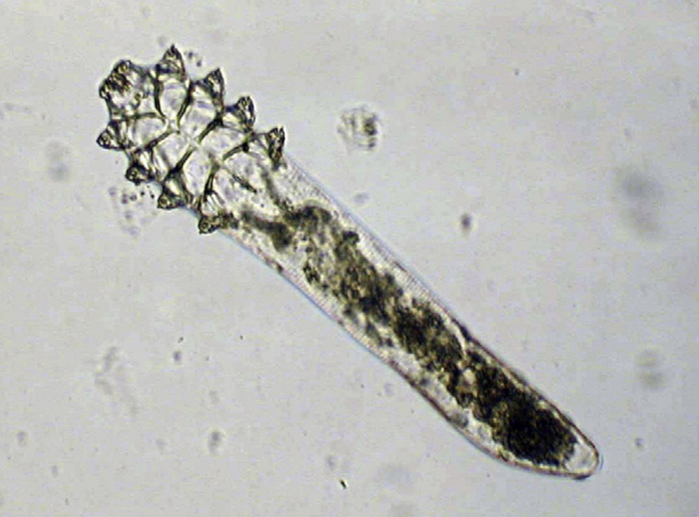

 

#

**Make sure to read, watch, or listen to all content on each tab before the corresponding class or lab!**

 

# Classes

### Class 1

### Class 2

### Class 3

### Class 4

### Class 5

### Class 6

### Class 7

### Class 8

### Class 9

### Class 10

### Class 11

### Class 12

### Class 13

### Class 14

### Class 15

### Class 16

### Class 17

### Class 18

### Class 19

### Class 20

### Class 21

### Class 22

### Class 23

### Class 24

### Class 25

### Class 26

# Labs

### Lab 1

**It'll be barely visible at first: a twitch.** A white mouse will be laid on its back on your desk, pinned to a wax tray, its organs exposed.Itself freshly dead, the mouse’s schistosome parasites will still be alive. Just within the hepatic portal vein and visible across the thin wall of the vessel, paired male and female worms will thrash, sensing their host’s demise.When I see this, I'm always awestruck at the devastation wreaked on the liver by wayward *Schistosoma mansoni* eggs, at the organ’s distention, its mounds of granulomas. I'm also awestruck at the thought that such eggs are – at this very moment – navigating the same winding route through human bodies, causing the same pathology.

[https://img.youtube.com/vi/ffsV86ytjSM/0.jpg](https://www.youtube.com/watch?v=ffsV86ytjSM)

(https://img.youtube.com/vi/JLMbpiywVxQ/maxresdefault.jpg)]
(https://www.youtube.com/watch?v=JLMbpiywVxQ)




This year, I'll kick off our labs by throwing you into the deep end of the parasitology pool. In our first lab, you will get to see **live schistosome adults in mice and hatch their eggs into miracidia.** You'll also get to see **another species of trematode in its snail intermediate host**. For this and all future labs, you'll be responsible for keeping a laboratory notebook of your observations. Make sure to finish reading the content on Lab 1 before your lab section meets!

    Phylum Platyhelminthes
            Class Trematoda
                  Subclass Digenea
                        Order Strigeiformes
                            Family Schistosomatidae
                                  *Schistosoma mansoni*
                                  *Schistosoma haematobium*
                                  *Schistosoma japonicum*
                        Order Plagiorchiida
                            Family Heterophyidae
                                  *Cercaria batillariae*

 

#### Phylum Platyhelminthes

The platyhelminths are commonly referred to as "flatworms", since they are typically dorsoventrally flattened. This large and diverse phylum is comprised of four major classes (Turbellaria, Trematoda, Monogenea, and Cestoidea) that we will study in more depth throughout the next few labs. The hypothetical relationships of these major groups are shown in the cladogram below, which traces the common ancestry among the groups. The platyhelminths as a group provide an exciting introduction to parasitology because one can trace the evolution and specialization for parasitism throughout the group. While studying the flatworms, pay particular attention to the reproductive anatomy, reproductive capacity, adaptations for a parasitic life style, and transmission stages.

    

 

#### The trematode life cycle 

The digenetic trematodes comprise a truly marvelous array of families, genera, and species. Classification of the Digenea is determined on the basis of the size, shape, and placement of suckers, arrangement of flame cells, and especially on details of the reproductive system. The Digenea are one of the largest platyhelminth groups, with an estimated 40,000 described species in at least 125 families. Taxonomy in this large group is still in a dynamic state.

The majority of the Digenea are equipped with two muscular suckers. The largest of these, the acetabulum (ventral sucker), is located on the ventral surface of the worm and serves as an attachment structure. The oral sucker surrounds the mouth and is located at the anterior end of the worm. Most digenes are less than 30 mm in length and many species are less than 3 mm. On the other hand, Hirudinella, a species found in the stomach of some marine fish species, may attain the length and girth of a summer squash.  Here's a video of an adult Hirudinella marina, which Chelsea dissected from the stomach of a pelagic wahoo (please forgive the way the camera moves and the noise in the background - this video was taken on a sailing research vessel on the high seas!):

https://www.youtube.com/watch?v=q8MpczbOYUE&embeds_referring_euri=https%3A%2F%2Fcanvas.uw.edu%2Fcourses%2F1479012%2Fpages%2Flab-1-overview-part-1-flatworms-and-the-trematode-life-cycle%3Fmodule_item_id%3D13387537&source_ve_path=MzY4NDIsMjg2NjY

The ordinal name, Digenea, refers to the fact that the life cycle of these flatworms involves an alternation of hosts, with asexual reproduction occurring in intermediate hosts. As many as three intermediate hosts and a single definitive host may be required to complete a digenetic trematode life cycle. The first intermediate host is typically a gastropod (snail). The definitive host is always a vertebrate. Asexual reproduction in parasites may occur in intermediate hosts; sexual reproduction (cross-fertilization of the hermaphroditic worms) occurs only in the definitive host.

Adult digenetic trematodes (known as “flukes” in the common vernacular) are typically found in the digestive tract and associated viscera of definitive hosts but may be found in almost any organ or tissue. The vertebrate definitive hosts typically have high vagility (i.e., they move across long distances), which facilitates the distribution of parasite eggs. All vertebrate classes serve as hosts to these parasites. Digenetic trematodes are economically and medically significant, as some species cause serious pathology in domestic animals and humans.

The digenetic trematodes have some of the most complicated life histories in the animal kingdom. Digenetic trematode life cycles are “indirect” or “complex”, meaning that more than one host species is required to complete the life cycle. All species have asexually and sexually reproducing life states and a minimum of two hosts: a **first intermediate host** and a **definitive host**. Many taxa incorporate a second or third intermediate host as well.  Although this may, at first, seem confusing, there are really two basic variations to the theme as follows:

1. Taxa that have an intermediate host (usually a snail) and a definitive host (vertebrate) only.
2. Taxa that incorporate additional intermediate hosts (which may be mollusks, annelids, arthropods, or vertebrates) between the first intermediate and definitive hosts.

 

    

 

Asexual reproduction occurs in the intermediate host. Sexual reproduction, resulting in the production of eggs, occurs only in the definitive host. There are three distinct larval stages involved in all digenetic trematode life cycles: the **miracidium**, **sporocyst**, and **cercaria**. Some taxa also produce **rediae** and/or encysted **metacercariae**. All of these life stages except for the miracidium can be found in first intermediate hosts. One of the many interesting aspects of digenetic trematode parasite life cycles is the parasitic castration of the first intermediate host. Parasitic castration is the elimination of reproductive capability in the host, and results from consumption of and interference with the gonad tissue by larval digenetic trematode parasites. The castrated host continues to live and compete with uninfected individuals in the host population, but only produces larval parasites.

**Miracidium:** The miracidium is the larval stage that develops within the egg produced by the adult fluke in the definitive host. After hatching from the egg, miracidia are infective to the first intermediate host. The miracidium is a minute, ovoid, aquatic, motile stage covered with cilia. These cilia are shed when infection is initiated by penetration of the host or consumption of embyronated eggs by an appropriate host. In the video below, you will see a miracidium (of the trematode species Fasciola hepatica) hatching out of its egg, using its cilia to swim away, and leaving behind an empty eggshell:

https://youtu.be/78u7YKKPEKY

**Sporocyst:** Infection of the first intermediate hosts begins when the miracidium enters that host and becomes a primary or “mother” sporocyst. The primary sporocyst gives rise to a second generation asexually; the second generation may be daughter sporocysts or rediae. Embryos within the daughter sporocysts may produce another generation of sporocysts, rediae, or cercariae. Sporocysts are “sack-like” organisms with no mouth or digestive system. The sporocyst absorbs nutrients directly from host tissue to supply the developing larvae. 

**Rediae:** SOME groups of digeneans produce rediae. Rediae have a rudimentary digestive system consisting of a mouth, muscular pharynx, and short, unbranched gut; this larval stage may be distinguished from a sporocyst based on the presence of these structures. Rediae can be quite active and even downright aggressive, feeding actively on host tissue and sometimes upon other larval trematodes within the host. Note that not all digenean trematodes possess a redia stage – some only produce sporocysts.

**Cercariae:** Cercariae are asexually produced by sporocysts or rediae, depending on the species of trematode. Cercariae are free-swimming, sperm-like creatures that encyst in or penetrate the next host. Three different scenarios are possible:

1. Penetration of a second intermediate host and development of an encysted stage (metacercaria) in that host.
2. Penetration of the definitive (vertebrate) host and development of the adult fluke in that host.
3. Encysting on a suitable substrate in the environment or on the outside of an intermediate host.

In the video below, you can see cercariae spilling out of burst sporocysts dissected from a snail intermediate host (note that you can see the ventral suckers clear as day on each cercaria!):

https://youtu.be/d3wced1DQd4

**Metacercariae:** The metacercaria is an encysted larval stage that occurs in many digenean life cycles. Metacercariae are infective to the definitive host in the life cycle. Infection of the definitive host by a metacercaria is always trophic: the definitive host consumes the metacercariae in an infected intermediate host or on food items. Metacercaria can develop in both invertebrate and vertebrate hosts and on invertebrates. The developing fluke may be visible inside of the cyst (as in the illustration below):

 

    

 

Having trouble keeping track of the trematode life cycle?  *The Oatmeal* is here to help! [This cartoon](https://theoatmeal.com/comics/captain_higgins) illustrates the three-host life cycle of one trematode (*Dicrocoelium dendriticum*) in a... memorable... way.

 

#### Order Strigeiformes

The Order Strigeiformes is pretty unique among the trematodes: instead of a three-host life cycle, the Srigeiformes use only two hosts (a first intermediate snail and a vertebrate definitive host). The Order Srigeiformes includes those digene species whose cercariae have forked tails. The cercariae also possess specialized glands for penetration of the hosts. The digenetic trematodes in the Superfamily Schistosomatoidea are usually **dioecious**, having separate male and female worms. The schistosomes are our representative material for this order, but they are **unusual in many ways and highly adapted for parasitism**. Adult worms live permanently in copula within the host.

 

    
    <em>Image courtesy of [CDC DPDx](https://www.cdc.gov/dpdx/schistosomiasis/index.html)</em>

 

Schistosomes are long, thin worms, an adaptation to living in the small blood vessels of the mammalian hepatic portal system. The **oral sucker** and **acetabulum** are adjacent in these worms. The male is recognized by the presence of the **gynecophoric canal**, a deep groove on the ventral surface that holds the female worm. The testis is also usually visible in stained specimens. The **genital pore** is just posterior to the acetabulum in the female worm. Lateral **vitellaria** occupy the posterior half of the body and the compact ovary is previtelline. The digestive **caecae** are usually visible as dark coiled tubes. What are these worms eating?

 

    
    <em>Image from [Boissier et al. 2019](https://www.researchgate.net/publication/337592635_Schistosoma_spp#fullTextFileContent)</em>

 

Schistosome cercariae are fork-tailed.  Once released from their snail hosts, they swim through the water column, seeking out a vertebrate definitive host.  In the case of *Schistosoma mansoni* and *Schistosoma haematobium*, the definitive hosts are human, and they infect human hosts by penetrating the skin of people bathing in streams, rivers, lakes, and ponds containing snails.  In lab, you will see only the adult and egg stages of this parasite, not the cercariae (even though the Wood Lab does keep living schistosome cercariae in its biosafety-level 2 facility).  Why am I not giving you schistosome cercariae to handle?

(https://youtu.be/vIfkRAdMvsE)

 

#### Demonstration instructions

##### *Schistosoma mansoni* adults in the vertebrate definitive host

Note that *Schistosoma*-infected mice were provided by the NIAID Schistosomiasis Resource Center for distribution through BEI Resources, NIH-NIAID Contract HHSN272201000005I (NIH: Schistosoma mansoni, Strain NMRI, Exposed Swiss Webster Mice, NR-21963)

Schistosomiasis (human infection with schistosome worms) is a debilitating disease, rarely killing but often disabling infected individuals. Today we will see the destructiveness of schistosomes firsthand. The US National Institutes of Health maintains the life cycle of *Schistosoma mansoni* in their laboratories near Washington, DC, using *Biomphalaria glabrata* snails as intermediate hosts and laboratory mice as definitive hosts. They provide infected mice to research and teaching laboratories around the country. We have access to these infected animals for our teaching laboratory. These mice gave their lives for science, so please treat them with respect.

Mice are great models for human schistosomiasis. Much of the schistosome-related pathology suffered by the mice is closely mirrored in human (and other vertebrate) patients. Five weeks ago, the mice you see before you were exposed to water with active *Schistosoma mansoni* cercariae. They were then shipped to UW, and we held them for six weeks, while their S. mansoni parasites developed. Some of these mice may be uninfected, but most will carry extremely heavy infections.

* Begin by performing an external examination of your mouse. Do you see anything unusual or notable? Measure your mouse’s length, from snout to rear and from snout to tail tip.
* Lay your mouse on its back and begin by making an incision from the anus to the throat using the small scissors. Keep your incision shallow to avoid damaging internal organs.
* Pin out the flaps of skin on either side of the mouse, exposing the body cavity.
* Observe and draw the internal organs. Note anything unusual.
* Compare the liver and intestines of the infected mouse to pictures of healthy mice (see below). What pathology do you observe in the infected mouse? The white spots on the liver of the infected animal are granulomas. Encapsulation of schistosome eggs by the host causes granulomas. What is the consequence to the host? How did the eggs get into the liver? * Where should they be?
* Now use your dissecting scope to explore the internal organs more closely. The adult worms are visible in the portal veins of your mouse.
* Once you have finished drawing your host, remove its parasites. Tease apart the organs to access the portal veins. * * * Breach the portal vein to pull out the worm, or pull out the entire vein.
* Place adult worms into Ringers’ solution. Can you differentiate between the male and female worms? Describe any movement or behavior that you see in these living specimens. Draw both the adults and eggs.
* Many of these worms will have ripe eggs. Any student who is able to obtain a miracidium will be awarded +3 points on the next exam. Hint: what kind of fluid will trigger hatching in a schistosome egg?
* The prominent lateral spine is diagnostic for this species. The eggs of Schistosoma japonicum have a less prominent spine and those of haematobium are terminal. How are spined eggs an adaptation for these worms? Most helminth parasite infections in humans are diagnosed by the presence of characteristic eggs in the feces or urine. You should be able to identify schistosome eggs on the exam.

 

    
    <em>(left) healthy mouse (right) mouse infected with *Schistosoma mansoni*</em>

 

##### *Cercaria batillariae* larvae in the snail intermediate host

The Japanese mud snail Batillaria attramentaria is native to Japan but was introduced to the US west coast in the early 1900s, probably in shipments of Asian oysters.In California, it has driven out a native mud snail, *Cerithidea californica*, in part because Batillaria has only one parasite (Cercaria batillariae), whereas Cerithidea can have up to 20! Greg Jensen collected these snails in mid-September from the intertidal zone in Silverdale, WA.

Please familiarize yourself with gastropod internal anatomy before you begin the dissection:

    
    <em></em>

Place three snails in a beaker of seawater. Add just enough water to cover the tops of their shells. Give them a few minutes, then remove the snails into a watchglass. Check the water for tiny, swimming cercariae with the naked eye. Place the water from the beaker into a watch glass and check closely with a stereomicroscope for cercariae.

Place one snail on the benchtop. Take a total length measurement (the longest dimension of the shell) and record this in your lab notebook. Crack the spire with a hammer (gently) to reveal the snail. Put the snail in a watchglass and moisten the animal with seawater. Carefully remove the shell pieces for better viewing and examine the animal under a dissecting scope. Infection may or may not be immediately apparent. The visceral hump (the spiral organ that contains the digestive gland and gonads) is the narrow, “corkscrew” extremity of the snail. If the visceral hump is whitish, tan, or mottled, the snail is probably infected with trematodes. If it is dark green or gold, the snail may be uninfected.

Examine the gonad for sporocysts and/or rediae. If you don’t see any at first, tear the tissue with forceps to examine the deeper tissues.

Draw any cercariae, rediae, or sporcysts that you find and record your observations. Have your TA check your snail for infection before you dispose of it! Record your snail data on the board (remember that zeros are data, too).

**Note:** If you do not succeed in finding an infection in your snails, please dissect another one or observe another student’s infected snail.

 

#### Questions

Please answer the following questions in your lab notebook:

1. How does the intensity of infection affect pathology in **Schistosoma mansoni** infection? Is prevalence a useful statistic for studying the epidemiology of schistosomes in the definitive host?
2. What is the most challenging aspect of adapting successfully to somatic endoparasitism?
3. Which larval stage (or stages) is/are infective to the vertebrate host? To the snail host?
4. How is parasitic castration an adaptive strategy for trematodes? What are the possible costs of this strategy?
5. Our lab keeps plenty of **Schistosoma mansoni**-infected **Biomphalaria** snails in a biosafety-level 2 containment facility in the Portage Bay Building right here on campus. Why didn't we bring you any to dissect?

 

[DON'T FORGET TO PASTE PANOPTO VIDEOS HERE]

### Lab 2

**Readings:** *How to Do Ecology,* Chapter 1

Now that you’ve done a deep dive into the trematodes, let’s take a broader view: we’ll check out a diversity of parasites from marine and freshwater fishes, covering monogenes, trematodes, cestodes, nematodes, acanthocephalans, and crustaceans. 

When I first started learning about parasites, I thought about them as "out there" - out in nature, out in the Global South, away from me.I could not have been more wrong. Parasites are around us, all the time, hidden just under the surface of everything that is familiar - your friends, your pets, even your food.  

To prove it to you, we're going to do some grocery store parasitology. 

    
    <em></em>

When you arrive at your lab section this week, you will be provided with one whole, ungutted, wild (not farm-raised) fish acquired from a local seafood market. We'll make note of the common name given by the seafood market, so that we can look up the Latin name for your lab notebook.Let's see what kinds of worms are lurking in the seafood aisle!

 

#### Demonstration instructions

Parasitology is a “blood and guts” subject. Dissection of freshly killed host organisms provides the best material for examining living parasites. In this lab, you will be examining and dissecting freshly collected teleost fishes. Fishes serve as intermediate and/or definitive hosts for a diversity of parasite taxa. If you are careful and observant, you may find many parasites in and on your specimens. Take your time as you examine the fish/host – **it will take some practice to develop a search image and many of the parasites are small**! Check out the representative drawings of fish parasite taxa before you proceed. Internal anatomy is very consistent across the vertebrates, and fish host many of the same types of parasites that are found in people (even some that may infect people!).

 

##### Fish dissection procedure

**Before you dissect:**

1. Collect the fish and place it on a dissection tray for easier clean-up.
2. Determine the species of the fish that you will dissect. Record the collection data (common name, Latin name, store it was obtained from, whether it is wild or farmed, where the seafood market told you it was from, date purchased) in your lab notebook.
3. Take the total length, standard length, and fork length measurements of the fish. Record this measurement in your lab notebook (always use metric units).

 

    
    <em></em>

 

**Ectoparasite assay:**

1. Consult the figure above to familiarize yourself with the external anatomy of the fish.
2. Refer to the figure below to develop a search image for some of the parasites that you may find; pay attention to the size ranges given. Which types of parasites should be easily visible without magnification?
3. Carefully examine the skin, fin rays, and lateral line of the fish for copepods, branchiurans, isopods, leeches, and monogenes. Remove the fins with scissors and use the dissecting scope to examine the tissue more closely.
4. Look in the mouth of the fish and probe the nasal capsules for parasites.
5. Examine the gill arches in situ. Remove the gill arches with scissors and examine the gill filaments carefully under the dissecting scope for monogenes.

    
    <em></em>

    
    <em></em>

 

**Endoparasite assay:**

1. Consult the figure above to familiarize yourself with the internal anatomy of the fish.
2. Use a scissor to make a cut on the abdomen of your fish from the vent/anus/cloaca to the operculum and slightly off the midline so that you do not cut through the digestive tract. Make several shallow cuts so that you do not puncture internal organs.
3. Using the scalpel and/or scissors, make two cuts through the skin and subcutaneous musculature, perpendicular to the first incision; make one cut behind the operculum and one in front of the cloaca form the abdomen to the spine.
4. Open this flap of skin and muscle or remove it to examine the internal organs (be careful not to sever the cloaca).
5. Determine the sex and reproductive status of your fish (if possible) and record these data.
6. Carefully remove the digestive tract (esophagus to cloaca) and put it in a dish.
7. Identify the organs of the digestive tract, proceeding from mouth to cloaca.
8. Examine the body cavity and mesenteries for nematodes and cestodes.
9. Identify and remove the gall bladder; place it in a watch glass with seawater.
10. Carefully open the stomach and examine it for parasitic nematodes. Record any stomach contents found.
11. Open the intestine and examine it for adult nematodes, cestodes, and acanthocephalans. These parasites may be seen without magnification but you will need to use the dissecting scope to look for trematodes. Use a squirt bottle of seawater to clear the specimen for viewing but be sure to check the tray for escapees.
12. Examine the muscles of your fish for encysted nematodes and cestodes.

**Documenting your observations**

1. You may want to sketch the parasites in situ in the host – these drawings provide great study material.
2. Remove the parasites that you find and place them in glass dishes with seawater. Record the site of infection, number of each taxon found, and other pertinent data in your lab notebook for each parasite.
3. Sketch the parasite/s (include size or magnification).
4. Make sure to confirm your identifications of any parasites you find with your instructor.
5. Make sure to count up the number of parasites of each taxon that you find.
6. Remember to record your observations on the white board. With data from across the entire class, we will be able to compare and contrast the number of parasites and the number of species of parasites across different kinds of hosts.

 

#### Slides to examine

In this lab and all the labs to follow, there will be slides for you to examine. **"But why,"** you wonder, **"should I look at slides when I can just find pictures of these organisms on the internet?"** I'll let you in on a parasitology secret: **photographs do not capture all of the nuance, detail, and beauty of the parasites.** Photographs are one-dimensional, but parasites are three-dimensional; that is to say, photographs can only bring a single plane into focus, but because parasites are 3D, there are many other planes where interesting stuff is going on. When you focus on a microscope slide, you can bring the deepest plane into focus, and then the next deepest, and so on to the shallowest plane, and in that way, what you see (and what you draw) is better than a photograph.

You are welcome to take photos of what you see in lab if it helps you learn, understand, and remember. But **I require all students to *draw, draw, draw* because it is the best way to truly *see* the parasites.** There is something about the act of your hand making a drawing that lets your eye see more than it otherwise would. Try it for yourself and you'll notice things that you've never seen before!

**Slides to examine:**

* Eggs
* Miracidiae
* Sporocysts
* Rediae (note pharynx and short gut)
* Cercariae
* Metacercariae
* Adult of *Platynosoumum fastosum, Dicrocoelium dendriticum* (incorrectly labeled as *D. lanceatum*), *Clonorchis sinensis, Heterophyes heterophyes,* or *Gastrothylax elongatus*

 

#### Lab 2 preview

**Want a sneak peak of this week's lab?** Check out the images below of the parasites that previous generations of FISH 406 students have found in their grocery store fish.

 

    
    <em>Monogenean parasite from gills of kinki rockfish (*Sebastolobus alascanus*)</em>
    <em></em>

 

    
    <em>Opisthaptor of monogenean parasite from gills of kinki rockfish (*Sebastolobus alascanus*)</em>
    <em></em>

 

    
    <em>Tapeworm larva (plerocercoid) from intestine of kinki rockfish (*Sebastolobus alascanus*)</em>
    <em></em>

 

    
    <em>Nematode larva from body cavity of kinki rockfish (*Sebastolobus alascanus*)</em>
    <em></em>

 

    
    <em>Nematode adult from intesine of kinki rockfish (*Sebastolobus alascanus*)</em>
    <em></em>

 

    
    <em>Copepod parasite from gills of kinki rockfish (*Sebastolobus alascanus*)</em>
    <em></em>

 

    
    <em>Copepod parasite (family Pennellidae) from gills of kinki rockfish (*Sebastolobus alascanus*), courtesy of Matt Wilson</em>
    <em></em>

 

[MATT WILSON'S VIDEO]

    
    <em>Acanthocephalan parasite from intestines of kinki rockfish (*Sebastolobus alascanus*)</em>
    <em></em>

 

    
    <em>Proboscis of acanthocephalan parasite from intestines of kinki rockfish (*Sebastolobus alascanus*)</em>
    <em></em>

 

[MATT WILSON CLAVINEMA VIDEO]

 

### Lab 3

**I have a confession to make:** of all the parasites, the cestodes are my favorites. I first fell in love with them when I was dissecting a pelagic fish aboard a sailing research vessel, and I found this:

[SEAMANS VIDEO]

What you're seeing above is a tapeworm larva in the Order Trypanorhyncha. These guys reach their adult life stage in the guts of sharks. This larval plerocercoid was laying in wait inside a tuna, hoping that its tuna host would deliver itself into the jaws of a shark so that it could fulfill its tapeworm destiny to mate and produce eggs in a shark intestine. The tiny tentacles that you see reaching out to you are armed with hundreds of rows of backward-facing spikes. These tentacles are used to attach the worm to the inside of the shark intestine.

Not only do the cestodes have super complex life cycles, but their body forms are wildly diverse, and they are just **heartbreakingly, staggeringly beautiful**. You'll get to see that for yourself in this lab. We'll have one species of cestodes for you to discover very much alive. I hope you'll come to love the tapeworms as much as I do.

During this lab, we'll also chat with you about the parasite species you're thinking about researching for your term paper and elevator pitch. Remember that you'll need to develop a plan to control, eliminate, eradicate, or augment your parasite, and you'll need to support your proposed plan with evidence and logic. Our conversation about this will be short this week - we just want to make sure that everyone has at least one potential parasite species in mind, and that not everyone has chosen the same parasite species! But do come to lab with some ideas about parasite species you might be interested in researching.

  Phylum Platyhelminthes
    Class Cestoidea
      Subclass Eucestoda
        Order Cyclophyllidea
          Family Hymenolepididae
            *Hymenolepis diminuta*

                                           

#### The cestodes

 

    
    <em></em>

The class Cestoidea is the final group of platyhelminths we will study. It is a very large group and entirely parasitic. Cestoidea are unique among the platyhelminths in that they have no mouth and no gut; they absorb all of their nutrients through their tegument (= external body surface) directly from the host. The tegument is composed of tiny, finger-like projections called microtriches, which increase the surface area of absorption and are coated in a macromolecule layer that buffers and protects the worm. Cestoideans are monoecious. The life history of this group almost always involves one or more intermediate hosts with larval stages that encyst and await being eaten by their successive host (= trophic transmission).

The subclass Eucestoda is sometimes referred to as the “true tapeworms” or “cestodes”. This group includes the long, segmented, ribbon-like worms we normally associate with the term “tapeworm”. As adults, eucestodes live in the intestines of vertebrates, where food is always plentiful.

 

##### General morphology

Morphologically, tapeworms have three distinct body regions. At the extreme anterior end is the holdfast, called a **scolex**, which may have various types of attachment structures (i.e., suckers, acetabula, hooks, tentacles, muscular protrusions, etc.). Posterior to the scolex, there is a short, unsegmented region called the **neck**. The neck is quite narrow and is a very poorly differentiated region. Within the neck region, however, is an area of high mitotic activity. This growth zone is continuously differentiating and is responsible for the proliferation of the segments, called **proglottids**. Each proglottid eventually develops a set of reproductive organs and is capable of generating many eggs. The remainder of the body consists of a chain of proglottids and the chain as a whole is referred to as the **strobila**.

 

    
    <em></em>

 

Closer observation of the strobili will reveal that the youngest proglottids are the most anterior (nearest the neck) and the most mature proglottids are at the posterior, “tail” end of the strobila. In the youngest (most immature) proglottids, only the primordial reproductive organs can be seen. As they develop and are pushed posteriorly, they mature and become capable of producing fertilized eggs. Depending on the taxon, some tapeworms retain proglottids on the strobila that have completely filled with developing embryos (“**gravid proglottid**”) that will eventually be expelled from the host with fecal material. Other tapeworms “drop” mature proglottids from the strobila and as separate entities, those mature proglottids can crawl around in the intestine, complete reproduction, and expel their embryos. Either way, fecal matter from infected hosts is loaded with tapeworm eggs awaiting ingestion by the next host.

The various orders of Eucestoda can be distinguished on the basis of the features of the scolex and the arrangement of the reproductive organs in a mature proglottid. Be sure to observe the scolex morphology and consider how it attaches to the villi on the mucosal surface of the intestine. Does it appear to grasp the villi or does it appear to wedge itself in the spaces between villi? In the mature proglottid, pay close attention to the position of the ovary and vitellaria, the testes, the cirrus sac, and the position of the genital pore.

One interesting factoid about cestodes is that they are shark parasites that have evolved over time to exploit many different vertebrate hosts. Of the 12 orders of tapeworms, 5 parasitize only elasmobranchs (sharks, skates, and rays). In fact, if you were to examine a family of related shark species, you can almost overlay the phylogeny of cestodes on that same cladogram. This relationship is an example of co-evolution.

 

    
    <em>Scolices of tapeworms in the Order Cyclophyllidea</em>

 

##### Order Cyclophyllidea

Cyclophyllideans comprise the characteristic cestode fauna of birds and mammals; few species are found in reptiles. About 18 families of cyclophyllideans are recognized, of which representatives of three (Taeniidae, Hymenolepididae, and Dilepididae) are sometimes found in humans. Pathology in humans is most severe when cyclophyllidean tapeworms attempt to use humans as the intermediate host.

Cyclophyllideans have a scolex with four stout **acetabula**. Most species bear a **rostellum**, a protrusible crown on the apex of the scolex that is sometimes armed with hooks. The **vitelline gland** is a single, compact mass located posterior to the ovary and medially in the proglottid; this feature is the most consistent for identification of the cyclophyllideans. The **ovary** is situated medially and is often bilobed, with a small ootype located between its lobes. From the ootype, the vagina proceeds anteriorly, then turns laterally to exit at the genital atrium. The **testes** are usually follicular and numerous, but in some groups such as *Hymenolepis* spp., they are compact and few in number. Sperm collection ducts leave the testes and open into the vas deferens, which terminates at the cirrus sac. In mature proglottids, the **uterus** originates anterior to the ovary and develops gradually, first as a median tube, and then begins to develop lateral branches, or sometimes breaks down into numerous capsules containing eggs (i.e., *Dipylidium*). Once the proglottid reaches the **gravid** stage of maturity, the testes, ovary, and vitellaria can no longer be seen, as they have spent all resources and diminished to allow room for expansion of the uterus. Unlike other cestode orders, eggs of cyclophyllideans have a thick, radially-striated embryophore, a protective outer layer surrounding the embryo. Remember that the host groups of cyclophyllideans are terrestrial and therefore eggs deposited in feces will likely be exposed to the drying elements of the atmosphere.

The life cycles of cyclophyllideans is different than many other cestode orders in that they do not require second intermediate hosts; therefore the plerocercoid stage is skipped. Most of the cyclophyllidean life cycles do require one intermediate host, an arthropod or mammal, depending on the species. Typically, the adult worm lives in the intestine of the definitive host and expels eggs that exit the host with the feces. The intermediate host ingests the egg stage. Gastric intestinal fluid triggers the egg to hatch and an oncosphere emerges. With its 6 hooks, the oncosphere burrows out of the intestine wall and migrates through the host to encyst. The definitive host becomes infected by eating the intermediate host tissues, which contain the larval cysts. The larval stages develop in a variety of ways and can cause moderate to severe pathology in the intermediate host.

 

    
    <em>Image courtesy of [CDC DPDx](https://www.cdc.gov/dpdx/taeniasis/index.html)</em>

 

##### *Taenia saginata* – beef tapeworm

* Only humans can serve as the definitive host. Cattle often serve as the intermediate host, with larvae encysting in the muscle fibers of cattle.
* Adult worms lack a rostellum and armature on the scolex. Mature worms are typically 3 to 5 meters in their human host and can get up to 20m long! The uterus of a gravid proglottid has 15 to 20 lateral branches per side. Pathology in humans is mild.
* Larval worms encysted in the intermediate host are called cysticerci (singular: cysticercus). For each egg that the intermediate host ingests, one cysticercus will develop in the tissue. In the larval form the scolex is formed but invaginated. Cysticerci typically encyst in muscle fibers. Infection of humans as intermediate hosts is not common.

 

    
    <em>Image from [Pu et al. 2022](https://doi.org/10.1016/j.gene.2022.146650)</em>

 

##### *Taenia pisiformis* – rabbit tapeworm

* Parasite of lagomorphs (rabbits), rodents, and carnivores. Adults occur in the small intestine of carnivores, and rabbits and rodents serve as intermediate hosts.
* Adult worms have a scolex with an armed rostellum and four suckers.
* Larval worms encysted in the intermediate host are also called cysticerci; a single egg infection will yield a single cysticercus larva.

 

    
    <em>Image courtesy of [CDC DPDx](https://www.cdc.gov/dpdx/echinococcosis/index.html)</em>

 

##### *Echinococcus granulosus*

* Carnivores serve as definitive hosts and herbivorous mammals serve as intermediate hosts. In the **wild**, the life cycle may occur in wolves and moose, lions and warthogs, or dingoes and wallabys (**sylvatic life cycle**). The life cycle can also occur between domestic dogs and domestic livestock (sheep, rabbits, goats, etc.). When the tapeworm enters a domestic animal, humans are at greater risk of being infected, usually by handling dogs and encountering eggs in fecal matter. The disease in humans when they become intermediate hosts of this tapeworm is called *hydatidosis* or hydatid disease.
* Adult worms possess an armed rostellum. Mature worms are small at about 5mm. The strobila usually consists of only 3 proglottids, where the terminal one is gravid.
* The larval worms often target the liver and lungs of the intermediate host to encyst. They develop into a specific type of bladder worm called a **unilocular hydatid**. Over time, the inner layer of the hydatid becomes a germinal layer from which **brood capsules** arise. Each brood capsule buds off inside the hydatid and develops its own germinal layer from which protoscolices arise. The hydatid grows very large and essentially is a sac full of brood capsules, which are full of protoscolices, the texture of which is referred to as "**hydatid sand**". Hydatids can grow to be enormous, holding 15 quarts of fluid. Imagine the severity if a hydatid develops inside a human in the liver, lungs, or brain! The danger of anaphylactic shock is great if the hydatid ruptures and releases antigenic material.

 

    
    <em>Image courtesy of [CDC DPDx](https://www.cdc.gov/dpdx/diphyllobothriasis/index.html)</em>

 

##### *Diphyllobothrium latum*

* The “fish tapeworm”, humans (and other mammals) become infected through consumption of plerocercoids in fish musculature. 
* Originally native to Scandinavia, western Russian, and the Baltics, the parasite is now common in North America.

 

#### Demonstration instructions

**Dissection of adult Tenebrio spp. beetles infected with cysticercoids of the cestode Hymenolepis diminuta**

1. Obtain your adult Tenebrio spp. beetle. Wear gloves and be careful - if ingested, this cestode could infect you!
2. Pinch off the head of the beetle with forceps to humanely kill it.
3. Remove the legs and wings with forceps.
4. Place the beetle dorsal side up in a small amount of saline solution and remove the thin dorsal integument with a pair of forceps.
5. Scrape out the entire contents of the body cavity into a glass dish with forceps.
6. Examine this material with a stereomicroscope.
7. Most of the cysticercoids are found among the small white bodies that adhere to the portion fo the gut just anterior to the insertion of the Malpighian tubules.
8. The parasites are translucent and characteristically show two small patches of opaque white granules on the anterior (larger) end.
9. Cysticercoids that are more mature have a longer "tail" portion and are easily distinguished by means of a stereomicroscope at 20x magnification.
10. If you can't find anything, tease the intestine into tiny shreds, so that you know you have checked every part of the intestinal tissue.
11. How might you induce these cysticercoids to transform into their adult life stage?  Come up with some ideas, and give it a try.

 

#### Slides to examine

* *Taenia pisiformis* or *Taenia saginata*
* *Echinococcus granulosus* adult
* *Echinococcus granulosus* hydatid cyst

 

#### Lab 3 preview

**Want a sneak peak of this week's lab?**  Check out the images and videos below of the parasites that previous FISH 406 students have found.

[MOVE PANOPTO VIDEOS AND IMAGES OF BEETLE CYSTICERCI IF NEED BE]
 
 

### Lab 4

**Readings**: Wood et al. 2023, *How to Do Ecology* Chapter 2

[FILL GAPS HERE]

This week, we'll begin with a discussion of the costs and benefits of eradication (don't forget to read Morrison et al. 2007 and Edwards and Leung 2009 in preparation). Then, we'll put you in pairs. Each member of the pair will share their idea, and your job is to provide your partner with constructive, critical feedback that will help them hone and shape their idea. Then, we'll get into larger groups, where you'll share your idea with your peers and instructors; everyone will chime in with their suggestions for improvement.

 

### Lab 5

    
    <em>Image courtesy of [CDC DPDx](https://www.cdc.gov/dpdx/)</em>

You've now seen at least a few nematodes from your fish dissection. This week, we will take a deep dive into this fascinating clade of parasites. You will come face-to-face with a disturbingly large (but thankfully dead) human-infecting nematode and some living insect-infecting nematodes. Remember to keep careful track of your observations in your lab notebook and make sure to finish reading the entire Lab 5 overview before your lab section meets!

The nematodes are an astoundingly large and speciose group of worms. Free-living nematodes are abundant in every habitat from marine and freshwater to soil. Parasitism is believed to have evolved in the nematodes a number of times from free-living forms. Today, parasitic nematodes are found in every vertebrate group, many of the invertebrate groups, and even in plants! In terms of abundance and number of species, nematodes outrank even the arthropods. Humans are hosts to a fair few species of nematodes, some of which are extremely pathogenic.

 

#### Morphology

**Note for the nematodes**: We will use common names to identify hierarchical groups for the nematodes in order to avoid overwhelming upper-level taxonomy :)

**Six distinct “body types”**

1. Trichostrongyles
2. Hookworms
    * *Necator americanus*
    * *Ancylostoma duodenale*
    * *Ancylostoma caninum*
3. Pinworms
    * *Enterobius vermicularis*
4. Whipworms
    * *Trichuris trichiura*
    * *Trichinella spiralis*
5. True roundworms
    * *Ascaris lumbricoides*
6. Filarial worms
    * Family Onchocercidae, including *Dirofilaria immitis*, *Onchocerca volvulus*, *Wuchereria bancrofti*,*Loa loa*
    * Family Dracunculidae, including *Dracunculus medinensis*

 

    
    <em></em>

 

Nematodes have a gestalt body form that is surprisingly similar and recognizable across the entire phylum. Yet, their sizes can range from less than a millimeter to nearly a meter in length. Typically, the body is bilaterally symmetrical, long, slender, and tapering at both ends. Their movement is distinctly **sinusoidal**, owing to their longitudinal muscle and lack of circular and transverse musculature. The outer part of the body is covered by a **cuticle** (noncellular, proteinaceous layer) that is excreted from an underlying dermal layer. The cuticle is molted a number of times during larval development, analogous to the way that arthropods molt their exoskeletons. The cuticle serves many functions, including protection from desiccation, a barrier to host immune response, and a turgid surface for the hydrostatic muscle contraction during movement. The mouth is located at the anterior end and is surrounded by a tripartite opening. A muscular pharynx follows and a tubular intestine runs the length of the body, terminating at the anus, which opens at the posterior half of the body.

Nematodes have separate male and female sexes (with rare exceptions). In many species, there is a high degree of **sexual dimorphism**, whereby the male and female morphology and overall size are quite different. In males, the reproductive system consists of testes, which are glandular and elongate throughout the body. In most species, males have **copulatory spicules** located at the posterior end of the worm. The spicules are eversible and used to position the female and hold the vulva open for sperm transfer during copulation. In some species, the male is also equipped with a **copulatory bursa**, a cup-shaped posterior end with finger-like rays used for grasping the female. The females are typically larger and the reproductive system consists of an elongate **ovary** that empties into the egg-filled **uterus**. The coils of the uterus terminate at a genital pore opening called the **vulva**.

Egg morphology is distinct. Most species have a unique shape, facilitating diagnosis. The timing of embryonation can vary; some embryonate while still in the female uterus and others embryonate in the external environment. In the external environment, some eggs will remain dormant and others will hatch and the larvae will begin to develop and molt before encountering its host.

 

##### Life cycles

Life cycles of parasitic nematodes vary among species. In some, there is no intermediate host involved. For direct life cycle nematodes, egg stages can be ingested by the host or juvenile stages can actively penetrate the host’s skin. Some nematodes use intermediate hosts, where they encyst in tissues and are trophically transmitted. Still others use vector intermediate hosts that actively transmit the infection between hosts. Nematodes that we will study today live in the gut of vertebrates as adult worms, and most have direct life cycles.

 

    
    <em>Image courtesy of [CDC DPDx](https://www.cdc.gov/dpdx/hookworm/index.html)</em>

 

##### Hookworm

Species of hookworms live in the intestine of their hosts, attaching to the mucosal surface and feeding on blood. They are distinctive in that they possess a **buccal capsule**, a large and heavily sclerotized “mouth” that is armed with cutting plates, teeth, or lancet-like structures. Eggs are passed in the feces. Juvenile stages emerge in the external environment and molt twice. The **J3 stage** (third-stage juvenile) is infective. Upon contact with the host, the J3 penetrates the host’s skin and enters the circulatory system, where they proceed to the lungs by way of small vessels leading to alveoli. The juveniles **migrate** through the lung, up the trachea, and down the esophagus to gain access to the intestine, where thy mature, mate, and produce eggs. Pathology is **intensity dependent** and can be severe. Hookworm eggs are large, oval, and often with a juvenile that is globular in appearance.

###### *Necator americanus*

* Human hookworm
* Buccal capsule has cutting plates
* Male has spicules with barbs at the tips, fused distally

###### *Ancylostoma duodenale*

* Also human hookworm
* Buccal capsule has plate with teeth
* Male spicules have simple tips, not fused distally

###### *Ancylostoma canium*

* Dog hookworm
* Juveniles that penetrate humans can cause “creeping eruption” or cutaneous larval migrans, since the larvae are “lost” in the wrong host. Bacterial infections can ensue, but they are not usually severe.

 

    
    <em>Image courtesy of [CDC DPDx](https://www.cdc.gov/dpdx/ascariasis/index.html)</em>

 

##### True roundworms

###### *Ascaris lumbricoides*

These are among the largest nematodes in existence. Males reach lengths of 15–31 cm, while females reach lengths of 20–50 cm. They are parasites of humans but can also live in pigs. High intensity infections may cause intestinal blockage and result in severe pathology. The eggs are round and have a ruffled **mammilated** layer that is unmistakable. The eggs are highly resistant and can survive in the environment under stressful conditions for years.

The life cycle of *Ascaris* is similar to that of hookworms, except that hosts are normally infected by ingesting the eggs. Once in the stomach, the juvenile hatches and burrows out of the stomach and into the circulatory system. Juveniles exit small vessels near alveoli and enter the lungs. Inside the lungs, juveniles molt twice, and then proceed to crawl up the trachea, down the esophagus, and eventually arrive at the intestine. *Ascaris* is believed by some to be related to the hookworms, and this juvenile migration may be a relict part of the life cycle.

 

    
    <em>Image courtesy of [CDC DPDx](https://www.cdc.gov/dpdx/enterobiasis/index.html)</em>

 

##### Pinworm

This group of nematodes contains species that infect mammals (including humans) and many that infect reptiles and insects. Most are known to have simple, direct life cycles. Study the general appearance of the male and female worms, noting their relative sizes. Observe that the female has a slender, pointed tail (hence the common name pinworm). Eggs of this group are characteristically large, oval, and flattened on one side. Developing larvae can often be seen in the eggs.

###### *Enterobius vermicularis*

This species is common in the intestine of humans and causes mild illness in children, but is not very pathogenic in adults. In the region of the head are two cuticular expansions, **cervical alae**. The **caudal alae** (at the posterior) are narrow and less well-defined. Study the morphology of male and female worms. Identify the vulva and uterus in the female and testis in the male. The male tail is curved and short and bears a single spicule.

The life cycle of *E. vermicularis* is direct but the females exhibit a particular behavior to increase the chance of **autoinfection** (a person infecting him/herself). Often at night, while the host is sleeping, a female nematode will creep near the anus and deposit eggs on the skin along with an itchy substance. Children especially are likely to scratch the itchy area, acquire the eggs on their fingers, and ingest them.

 

    
    <em>Image courtesy of [CDC DPDx](https://www.cdc.gov/dpdx/trichuriasis/index.html)</em>

 

##### Whipworm

###### *Trichuris trichiura*

This species is a parasite of primates (including humans) and pigs. The body is whip-like with two distinct regions. The long, slender half is the anterior. The mouth occurs at the tiny tip and the esophagus is long and narrow. The intestine begins where the body of the worm thickens. Note the single spicule of the male. Eggs are very distinctive with an oval shell and **polar knobs** at either end. The life cycle is direct and people become infected by ingesting eggs from the external environment. Eggs embryonate in the external environment in moist, shady soil. Once ingested, the larva emerges and penetrates into the mucosal tissue of the large intestine down to the basal cells. They remain embedded, feeding on cell debris and blood. As they mature, the thick body of the worm protrudes into the lumen, expelling eggs. Pathology is not severe in adults with low-intensity infections, but children or immune-compromised individuals with high intensity infections are at risk of dysentery and anemia caused by chronic hemorrhaging of the intestinal wall.

###### *Trichinella sprialis*

This species is parasitic in humans and many other mammals, domestic and wild. Pathology can be severe in human infections. Adult worms live in the small intestine. Once a female worm is fertilized (mated), she will penetrate the mucosal lining of the intestine and deposit larvae into the circulatory system. Hundreds of larvae circulate and seek out muscle tissue (i.e., heart, diaphragm, etc.). A juvenile will enter a host cell and encyst intracellularly, converting all of that cell’s metabolic functions toward its own development. The host cell, called a nurse cell, provides a contained, protected juvenile package. When the host dies and another mammal feeds on the infected tissue, the juvenile springs into action in the new intestine, ready to mature and continue the cycle. Thus, each host that is infected with adult worms becomes the proprietor of the juvenile infective to the next host in its own tissues.

Examine sections of infected muscle tissue. The juveniles often are rolled up spirally (to fit inside the elongate cells). After time, calcareous granules may accumulate around the cyst/nurse cell, and eventually the cell and the worm may become calcified. Imagine the long-term effects on the human if thousands of cells experience this infection. It is extremely difficult to treat, as the problem is intracellular.

 

    
    <em>Image courtesy of [CDC DPDx](https://www.cdc.gov/dpdx/lymphaticfilariasis/index.html)</em>

 

##### Filarial nematodes

Filarial worms are a group of tissue-dwelling nematodes that infect terrestrial vertebrate hosts. Adult worms are very long and slender (**filiform**) with reduced features. Filarial worms cause some of the most pathogenic diseases in humans and domestic animals. All species use **arthropods** as intermediate hosts.

Members of the family Onchocercidae employ the arthropod intermediate host as a **vector**. A vector host actively transfers infective stages of the parasite from one host to another when feeding. Among onchocercids, adult females are **ovoviviparous**, giving birth to active juveniles called **microfilariae**. The female worm often deposits microfilariae directly into the circulatory system of the host. Thousands of microfilariae circulate, navigating to the peripheral blood vessels to increase their chances of being ingested by an appropriate arthropod vector species. Once inside the proper intermediate host, the microfilariae will molt and undergo further development. When the arthropod takes another blood meal, the infective larvae exit the arthropod onto the skin of the vertebrate and penetrate the bite wound to gain access into the new definitive host. Microfilariae are often the diagnostic stage used by physicians, since a simple blood smear of an infected individual will often yield microfilariae. Microfilariae are **multinucleate** and sometimes retain the egg membrane as a **sheath**. The extent of nuclei and presence of a sheath are characters used to distinguish species. Microfilariae often exhibit **periodicity**, whereby they are found in highest densities in the peripheral blood vessels close to the skin at specific times of the day to coincide with the peak feeding activity of their vector host.

###### *Dirofilaria immitis*

This species is primarily a parasite of dogs but many other mammals are susceptible. The disease is commonly referred to as “**heartworm**”, as adult worms live in the right side of the heart and pulmonary artery. Infection in dogs can lead to cardiopulmonary failure and death if untreated.

The life cycle of *D. immitis* involves a mosquito as the vector host. Adult worms live in the heart and females release microfilariae directly into the bloodstream. Mosquitoes ingest the microfilariae while taking a blood meal. Inside the mosquito, the nematode larvae molt in the Malpighian tubules to become J3s (3rd juvenile stage). The J3s migrate to the mouthparts of the mosquito so that they can readily drop onto the vertebrate host’s skin while the mosquito is taking its next blood meal. The J3s use the mosquito bite wound to enter the host and advance into the circulatory system. Mature worms can be found in the heart after about five months.

###### *Onchocerca volvulus*

This species causes a disease in humans known as **onchocerciasis**, also known as **river blindness**. Its distribution includes Africa, Arabia, and the tropical Americas. Adult worms live **subcutaneously** near the bite wound of the insect vector (black flies, **Family Simuliidae**). Adult worms live in pairs or groups and become encapsulated in host collagen material, forming a fibrous nodule (**onchocercoma**) beneath the skin. Females release unsheathed microfilariae that remain in the skin tissue. Black fly vectors will ingest the microfilariae when biting. In the black fly, the nematode larvae molt to become J3s and migrate to the labium so that they can easily exit the black fly when it takes another blood meal, and enter the bite wound.

Adult worms and microfilariae cause pathology in infected individuals. The onchocercomas, containing adult worms, are not terribly symptomatic, but can occur wherever the person has been bitten (arms, legs, back, pelvic area, chest, head). The microfilariae cause greater problems. They are released by the hundreds and invade subcutaneous tissues all over the body, eliciting inflammatory response and causing dermatitis and lesions. Blindness occurs frequently when the microfilariae invade the eye and then die, causing lesions and scarring of the cornea over time. This is especially common when bite wounds are on the head. As the black flies are common in fast-moving stream areas, the disease has long been known as river blindness.

###### *Wuchereria bancrofti*

This species causes a disease in humans called lymphatic filariasis (you may sometimes see it called by an old name that I don't recommend you use because it stigmatizes patients: elephantiasis). Its distribution is across the equatorial belt worldwide. Adult worms live in the lymphatic ducts near major lymph glands, primarily in the lower half of the body. Females release sheathed microfilariae into the lymph system, which merges with the general circulatory system. Microfilariae of this species often demonstrate **periodicity**, whereby they migrate to the peripheral blood vessels near the skin during the late evening hours when the mosquito vectors are biting.

Adult worms cause most of the pathology associated with this parasite by eliciting a strong immune response and inflammation of the affected area. Secondary bacterial infections further exacerbate the problem and, over time, blockages of the afferent lymph system can occur. Over the long term, areas afflicted by the adult worms near the lymph nodes can become scarred over with fibrous material generated from the host immune response. Lymph fluid collects and is trapped in the affected appendage causing a painfully swollen condition.

###### *Loa loa*

This species affects humans and is known as the “eyeworm”. Its distribution is in tropical West Africa. Adult worms live subcutaneously and are mobile. Microfilariae exhibit periodicity and appear in the peripheral blood during daylight hours. The vector is the biting deer fly (Chrysops spp.). Pathology is not as severe as other onchocercid nematodes, but adults can elicit an inflammatory immune response in subcutaneous tissue, called Calabar swellings. The swelling disappears after the worm moves on. Occasionally, worms enter the conjunctiva of the eye and can be seen crawling within the white tissue, hence the common name.

###### *Dracunculus medinensis*

This species is also known as the **Guinea worm**. Its distribution includes Africa, India, and the Middle East. *D. medinensis* infects humans and is one of the longest nematodes known; females reach up to 80 cm! Adult worms are tissue-dwellers, often inhabiting the lower extremities. Female worms have a uterus with extensive branching. Gravid females are so full of developing embryos that a strong internal pressure is created within the worm. The female migrates near to the skin surface and a portion of her cuticle erupts, forcing juveniles out into the subcutaneous layer. The host immune system reacts and a blister forms at the site of the eruption. When the host wades into cool water, such as in a stream, the female nematode begins contractions, forcing juveniles out of the blister wound. The juveniles enter the water and are readily consumed by the intermediate host, a **cyclopoid copepod**. In the arthropod host, the larval nematode migrates to the hemocoel and molts to become the J3 infective stage. Humans become infected by drinking water containing infected copepods. In the human, the nematode penetrates the duodenum and abdominal muscles to enter the subcutaneous connective tissues, where it will mature.

Pathology is caused by the secondary infections that are likely to occur when a gravid female induces the blister wound. Removing the worm is tricky, and if it breaks, antigenic substances are released deep inside the tissues of the host.

 

[PASTE: https://youtu.be/6AZ-1sE3y7E]

 

#### Demonstration instructions

**Adult *Ascaris* spp. nematode dissection**

Obtain an *Ascaris lumbricoides* or *Ascaris suum* worm for dissection. Wear gloves and be careful – these eggs have a small chance of being viable, despite fixation in formalin!

1. Find the mouth at the anterior end, noting the three lips, one dorsal and two lateroventral.
2. Affix the worm in a dissecting pan dorsal side up by piercing with a pin near the anterior end. Carefully slit open the body from the anterior working posterior, pinning down the flaps of the cuticle as you go. Observe the body cavity and the hydrostatic pressure that would exist in a live worm.
3. Observe the different regions of the alimentary canal: an esophagus, a muscular pharynx, a simple flat intestine, and the position along the body where the anus exits.
4. In a female specimen, the **vulva** is situated midventrally and about one third down from the anterior end of the worm. The **vagina** is a short tube connecting the vulva to the bifurcated uterus. The two branches of the uterus coil posteriorly and then anteriorly, becoming **oviduct** along the way. The **ovary** lies at the terminal end, where the oviduct is coiled and fine. Eggs simply move along the oviduct and end up in the uterus, where they can be fertilized by the male.
5. In a male specimen, there is a single **testis**, a long, fine, tightly coiled tube that is continuous posteriorly with a wider tube, the **seminal vesicle**. The latter organ leads into a short, muscular **ejaculatory duct**, which opens into the cloaca. Two **spicules** arise in pouches of the cloaca and may be seen projecting from the anus.
6. Be sure to observe the morphology of both sexes: examine a neighbor’s specimen. When finished, please dispose of all tissues in the designated trash. **Wash equipment and hands thoroughly with soap. Bleach surfaces.**

[INSERT NEW LAB ON CANNED SALMON]

 

#### Slides to examine

Draw at least 5 of the following:

* *Ancylostoma duodenalis* - larvae or adults
* *Necator americanus* - eggs or adults
* *Ascaris lumbricoides* - eggs or cross section (slide is labeled "c.s.")
* *Trichuris trichiura* - eggs or adult
* *Trichinella spiralis* - encysted larvae
* *Enterobius vermicularis* - eggs or adult 
* *Onchocerca volvulus* - female cross section
* *Loa loa* - microfilariae

 

#### Questions

1. What other parasites besides nematodes are dioecious?
2. Why is hookworm pathology intensity dependent? What function does the buccal capsule perform in hookworms?
3. Which nematodes would you be concerned about contracting if you were living on a farm and working with pigs? How could you become infected?
4. How can people best prevent becoming infected with onchocercid filarial worms?
5. Explain how a vector is different from an intermediate host.
6. It is often observed that damming African rivers increases schistosomiasis above the dam and river blindness below. Why?
7. Why is the prevalence of Enterobius vermicularis higher in children than adults?
8. “Periodicity” is a distinguishing feature of filarial worm life cycles. If you were a filarial worm, at what time of day would you choose to be most active in your human host’s peripheral circulation?
9. How many more reasons do you need to stop eating undercooked meat?

 

#### Lab 5 preview

**Want a sneak peak of this week's lab?** Check out the images and videos below of what previous FISH 406 students have found.

[video of introductory spiel and Ascaris dissection]

 

    
    <em>REDRAW AS THIS MATERIAL MAY BE COPYRIGHTED</em>

 

### Lab 6

**Readings**: *How to Do Ecology* Chapter 8

As we've traversed the parasite tree of life , we've so far focused primarily on vermiform parasites (i.e., wormy dudes). Today, you'll get to come face-to-face with a different group of parasites: the arthropods (i.e., crunchy dudes).

For the past several weeks, we have been raising our very own colony of arthropod parasites: jewel wasp (*Melittobia digitata*) parasitoids of blow fly pupae (*Sarcophaga* spp.).  We've already seen several generations of wasps deposit their eggs in blow fly pupae, create their own pupae, and metamorphose into adult jewel wasps.

Today, you will:

1. Dissect an *entoniscid isopod* (**Portunion conformis**) from a local shore crab (**Hemigrapsus oregonensis** or **H. nudus**):

[INSERT VIDEO OF PORTUNION]

2. Extract from your very own face a living Demodex spp. mite!

 

    
    <em>*Demodex folliculorum* mite from a human face. Image from [Elston and Elston 2014](https://doi.org/10.1016/j.clindermatol.2014.02.012).</em>

 

[INSERT VIDEO HERE]

3. Observe jewel wasp parasitoids.

[INSERT VIDEO HERE]

 

#### Demonstration instructions

Today's demonstration will have two parts:

1. You'll perform a dissection of shore crabs (*Hemigrapsus oregonensis* or *H. nudus*) infected with the entoniscid isopod *Portunion conformis*

2. You'll extract and visualize your own facial mites (*Demodex folliculorum* and *D. brevis*)

**Entoniscid isopod *Portunion conformis***

Euthanizing crabs can be challenging, and we want to make sure that (1) the crabs are all dispatched humanely and (2) you guys aren't too traumatized by the process of performing the euthanasia on your own. So your TA will do all the euthanasias and present you with freshly dead crabs for your dissections.

*Portunion conformis* is an endoparasite of the local shore crabs, *Hemigrapsus oregonensis* and *H. nudus*. These parasites actually feminize male hosts, which is apparent in mature infections but may be subtle.

1. Obtain your freshly dead crab. Your TA will sever the cerebral ganglion for you. The legs might kick for a few more seconds, but these are just reflexes - the crab isn't feeling a thing.
2. Record the species, sex, collection data, and the carapace width of each crab. 
3. Make a drawing of the crab, especially the morphology of its abdomen.
4. Gently flip back the abdominal flap. If a lemon yellow spot is visible at the base of the abdomen, you'll know that the crab is infected with an adult female *Portunion conformis*. If the yellow spot is lacking, you will look carefully for the more subtle signs of an early infection. If the host is female, look through the thin, transparent membrane alongside the intestines on the underside of the abdomen. Normally, the blood is colorless, but if the blood appears brown, the crab is infected with a juvenile parasite. Consumption of the host ovary by the young parasite releases brown vitelline pigment into the blood of the host, resulting in brown coloration. Write down your observations.
5. From here on out, we'll proceed with caution, as the parasite is large, morphologically complex, and intertwined with host tissue.
6. Insert a scalpel at the posterior-lateral corner of the carapace where it joins the abdomen. Then lift the carapace carefully to expose the hemocoel of the crab. 
7. Mature parasites should be immediately apparent; the female looks vaguely maggot-like and is pale yellow, orange, or white. If a large parasite is present, you should carefully sever the intestine (the most fragile part of the parasite underlies the intestine). Using forceps as a scoop, gently flip the parasite from the cavity of the thorax into the still partially attached carapace. Most of the host's organs may accompany the parasite in this maneuver. Then float the parasite out by placing the "backed" crab in a watchglass and covering with seawater.
8. Examine the crab under the dissecting microscope and carefully dissect the parasite from the carapace. The anterior portion of the parasite's brood chamber (marsupium) is interdigitated with the host's organs in the anterior part of the carapace, in front of the host's mouthpart musculature (buccal apparatus). The parasite may most easily be removed if the host's buccal apparatus is lifted in toto and the parasite scooped out of the empty shell.
9. Draw the female entoniscid. If you don't find one, draw your neighbor's.
10. Try to find the dwarf male hanging out nearby.
11. If the female is carrying epicaridian larvae, draw those too.
12. Remember to label the structures in your drawings of the females, males, and epicaridian larvae.
 
 

**Facial mites (*Demodex follicularum* and *D. brevis*)**

The vast majority of adult humans host the human eyebrow mite, *Demodex folliculorum*, an ectoparasite of the human face. Mites burrow into hair follicles of eyebrows and eyelashes and lay their long bodies parallel to the emerging hair. These mites are most active at night. Those humans who do not contract the mites vertically (e.g., from nuzzling mom as an infant) probably contract mites horizontally (e.g., later in life, from nuzzling other folks at night). Mites have been weakly linked to some skin diseases, but are thought to be largely harmless. We will assay your face for *Demodex folliculorum*.

1. There are several ways to do this. We will start by crazy-gluing a piece of transparent tape to a microscope slide, sticky side up. Once the glue is dry, apply the sticky tape to your eyebrow line, press firmly, and remove. If you're lucky, several tiny hairs (along with their associated follicles) will be removed by the tape.
2. Drop a bit of mineral oil on the tape, add a cover slip, and examine under low magnification on a compound microscope.
3. You can also try "expressing" the mites - this is a fancy way of saying, "squeeze your skin like you're popping a zit and scrape the oil onto a microscope slide". Around the eyebrows and nose are popular places for mites. Once you have the oil on a slide, drop some mineral oil on top, add a cover slip, and examine under low magnification on a compound microscope.
4. This might require a few tries. *Demodex follicularum* can be tough to get a hold of during daytime hours.
5. Once we find a mite, please make a detailed drawing and label as many structures as you can. If you don't find your own mites, draw your neighbor's.

 

#### Questions

1. Malaria has been successfully eradicated in the US. How was this accomplished?
2. What are two methods for the control of insect pests and insect vectors? What are the costs and benefits of these different methods?
3. How does resistance develop in insect vectors and the pathogens that they carry? What are the implications for human health?
4. What factors potentially limit size (relative to the host) in non-parasitoid endoparasites?
5. What factors must a conscientious biologist consider and research before attempting any application of biological control agents?
6. Match the disease to the vector:

* vectors = tse-tse fly, *Boophilus* tick, rat flea, kissing bug, *Anopheles* mosquito, black fly, deer fly, hornet, *Ixodes* tick 
* diseases = falciparum malaria, lymphatic filariasis, river blindness, Lyme disease, bubonic plague, Rocky Mountain spotted fever, *Babesia*, African sleeping sickness, *Giardia*

 

### Lab 7

 

    
    <em>Image courtesy of [Hebrew Matio via CC-BY-SA-4.0](https://commons.wikimedia.org/wiki/File:Dog_Breeds.jpg)</em>

 

We've done a lot of gross stuff this quarter, but today's lab will be the grossest. Today, we focus on the protozoa - the smallest parasites we've covered so far. In order to see these parasites, you'll have to use a powerful compound microscope.

Here are our two activities for today's lab:

1. You will **dissect termites to view the many species of symbiotic protozoa** that live in their gut and help the host digest wood.

2. You will perform a veterinary procedure called a "**fecal float**" to identify protozoan (and maybe, if we're lucky, some helminth) cysts in dog poop! We might also have some wildlife poop on hand.

 

#### Flagellates

The flagellates consist of a large diversity of protozoan forms whose relationships are not well understood. The taxonomy of flagellate groups has shifted quite a bit in recent years, and new phyla have been elevated (see textbook), so we will just recognize groups at the level of Orders. Among the flagellates, many are free-living aquatic organisms. Parasitism appears to have evolved a number of times in different groups.

Flagella are slender, whip-like structures that function as locomotory organelles. They are common to all protozoans we know as flagellates. The ultrastructure of flagella is a specific microtubule arrangement that is the same in **cilia** (9 peripheral and 2 central). But flagella articulate into a longitudinal axis of the body of the protozoan, whereas cilia cover the body surface. Most protozoans possess **centriole** organelles; flagellates possess a certain type of centriole called a **kinetosome**, from which the **axostyle** and **costa** arise. The axostyle is a rod-like bundle of microtubules that runs longitudinally in flagellates, providing the support for flagellar movement. Many flagellates have an **undulating** membrane, which is like a flexible fin running along one axis of the body such that the distal edge of the fin is a flagellum, and the base of the fin is the costa. Flagellates can have multiple and sometimes a reat number of flagella, some of which may articulate into the central axostyle and others that articulate into lateral grooves.

Most flagellates that are intestinal parasites have two life stages: trophozoites and cysts. Both stages are very small, usually well under 1 mm. The cyst stage is expelled in the feces of infected individuals. Cysts are resistant, thick-walled, dormant stages that are infective tot the host when ingested. Once inside the host, gastric fluids induce the trophozoite stage to emerge from the cyst. The trophozoites reproduce **asexually** inside the host’s intestine by **longitudinal binary fission** in which the flagellate body divides longitudinally. Tremendous numbers can accumulate and pathology varies among the species. Regions where sanitation is poor and fecal contamination of drinking water and agriculture persists favor the transmission of human flagellate parasites.

 

    
    <em></em>

Image courtesy of [Adrian Pan via Creative Commons Attribution-Noncommercial-No Derivative Works 2.0 Unported License](https://www.flickr.com/photos/phylomon/8662461983)

 

#### Coccidian apicomplexans

Coccidian apicomplexans are all endoparasites of vertebrates and invertebrates. The life cycle may be direct or indirect but always involves a prominent stage of intracellular reproduction that often contributes significantly to pathology in the host. Typical sites of infection include the digestive tract epithelium, liver, kidney, and erythrocytes (red blood cells).

The life cycle typically involves three distinct phases: **schizogony** (merogony in your text), **gamogony** (gametogony in your text), and **sporogony**. Infective **sporozoites** are ingested by the host (Order Eucoccidia) or delivered in the bite of an infected insect micropredator (Order Haemosporida). Each sporozoite invades a host cell and becomes an amoeboid, feeding, growing stage called the **trophozoite** (sound familiar?). The trophozoite undergoes schizogony, a series of asexual divisions, to produce **merozoites**. The merozoites emerge from the host cell to infect healthy cells and initiate further cycles of schizogony or become gamonts. Gamogony produces “male” **microgametocytes** and “female” **macrogametocytes**. The microgametocyte then divides to form flagellated microgametes. Fertilization of the microgametocyte results in a **zygote**. The zygote is encased in an **oocyst**. Within the oocyst, the zygote undergoes further asexual divisions, producing sporozoites for transmission to the next host.

In this lab, we will examine coccidian apicomplexans. Current classification is rapidly changing, so we will use “coccidian” as a common name for this group. Eucoccidian parasites cause serious disease in humans and domestic animals. Immunocompromised humans are particularly susceptible to coccidiosis; individuals infected with HIV often succumb to coccidian infections that would be unusual in healthy individuals.

 

    
    <em></em>

Image courtesy of [Joel Mills via CC BY-SA 3.0](https://en.wikipedia.org/wiki/Coccidia#/media/File:Coccidia.JPG)

 

#### Demonstration instructions

**Termite flagellate demonstration**

Termites and wood roaches share in common the habit of dining on wood. Most other insects and animals do not feed on wood because the dense, splintering cellulose matter is tough to digest and the enzyme cellulose is required. Termites and wood roaches share the same secret: they both have intestinal communities of flagellates that produce cellulose as a by-product of their own metabolic functions. This is a perfect example of a mutualism. The termite benefits by receiving the enzyme required to digest its food and the flagellates benefit by having a host to provide habitat with plenty of food. Without their intestinal flagellates, termites and wood roaches would starve.

The communities of flagellates in the intestine of a single termite are staggering. Fourteen genera are known. Thousands of individuals of multiple species can infect a single termite. How the species interact is unknown. You will have the opportunity to examine one for yourself.

Each student should dissect two termites. You are looking for the flagellates located in the gut. Remove the entire intestinal tract and smear it on to a clean glass slide, add a drop of Ringer’s solution, and then add a coverslip. Find, observe, and draw as many different types of flagellates as you can. Use oil immersion at 100x and clean the scope with lens paper and 100% ethanol when you are finished.

 

    
    <em></em>

Image from [Brugerolle and Bordereau 2004](https://doi.org/10.1016/j.ejop.2004.05.001)

 

**Dog poop demonstration**

In this demo, we will survey the intestinal parasite fauna of some local mammal species. Dog poop is (as you can imagine) easiest to acquire. Dogs are definitive hosts to a variety of cestodes, nematodes, and protozoan parasites. Infective stages (eggs, cysts, proglottids) are voided in the feces. Best results are obtained from dogs who are not regularly treated with anti-helminthics (de-worming medicine). Bring your dog’s poop or the poop of another cooperative canine. We will also have poop from several other terrestrial and aquatic mammals.

**NOTE**: Do not, under any circumstances, collect raccoon feces. Raccoons may be infected with the nematode *Baylisascaris procyonis*, and you could become infected by handling the feces. This worm can cause devastating pathology in human hosts.

*Fecal sample preparation:*

1. Examine your poop. Note anything unusual (e.g., proglottids, food particles).
2. Obtain an OVASSAY fecal sample collection device.
3. To prepare the sample, remove the insert from the collections vial, fill the small end of the insert by pressing it into the fecal sample, and place the loaded insert back into the device.
4. Close the cap.
5. Host data are an important part of sample collection in parasitology. Without this information, the sample has little or no scientific value. Record the following host parameters:

* Sex and approximate age of dog
* Breed of dog (or best guess)
* Condition of dog: This will give a proxy for health / level of veterinary care that the dog receives. Is the animal well-groomed? Does it have bright eyes and a sprightly demeanor, or is the unfortunate creature a victim of neglect with a matted coat, mangy skin, and a lackluster attitude?
* Evidence of human supervision: Be sure to record the presence/absence of a collar, tag, leash, and owner. Is the dog walking its human (and therefore probably valued and cared for) or is it simply loitering with no human supervision?
* Record all host data in your lab notebook.
 
*Fecal sample assay:*

1. WEAR GLOVES. Chew cinnamon gum if you are bothered by the smell.
2. With the poop-filled insert in place, add the float solution to your collection vial until the fluid fills half of the chamber.
3. Mix thorough by rotating the insert. This separates eggs and cysts from the fecal sample.
4. Apply pressure on the poop-filled insert until it is firmly seated in the collection vial (you may use the cap to do this).
5. Carefully fill the vial to the brim with flotation solution. Form a meniscus.
6. Place a coverslip on the meniscus for 10 minutes. Carefully transfer the coverslip to the slide for microscopic examination.
7. Remember to close the vial cap tightly for disposal!
8. Use the compound microscope to examine your slide – these eggs and cysts are tiny!
9. Scan the sample at 40X, looking for any regularly shaped objects among the debris.
10. Helminth eggs are often golden and round, oval, or oblong. Use the key to helminth ova below to identify any eggs that you find.
11. Some of the eggs can be identified under the 40X objective, but others will require oil immersion. Cestode eggs are particularly interesting, so be sure to use oil immersion to examine these. Ask your TA to show you how to do oil immersion.
12. Protozoan cysts are usually round and extremely small, so oil immersion will be required to observe cysts. Draw any eggs or cysts that you find in your sample and identify the parasite to the most accurate taxonomic level. Record your data on the board.
13. What features can you use to determine the taxonomic affinities of eggs in poo?

 

    
    <em>Image courtesy of the [University of Saskatchewan Western College of Veterinary Medicine](https://wcvm.usask.ca/learnaboutparasites/diagnostics/eggoocyst-comparison---canine-flotation.php)</em>

 

    
    <em>Image courtesy of Knott and Elliott, [University of Queensland](https://shire.science.uq.edu.au/parasites/helminths/nematodes/faecal-floats.php)</em>

 

#### Slides to examine 

**Draw at least 5 of the following:**

* *Entamoeba histolytica*
* *Entamoeba coli*
* *Chilomastix mesnili*
* *Giardia lamblia (duodenalis)*
* *Trichomonas vaginalis*
* *Trypanosoma rhodesiense*
* *Trypanosoma cruzi*
* *Leishmania major*
* *Eimeria* spp.
* *Toxoplasma gondii*
* *Plasmodium falciparum*
* *Plasmodium cynomolgi*

 

#### Questions

1. How are you most likely to become infected with a parasitic flagellate?
2. If a village is plagued by multiple species of intestinal flagellates and amoebas, what does that tell you about the living conditions in that village?
3. How do young termites obtain a flagellate infection, which they need in order to digest food?
4. Termites have complex social communities with a caste system. Can you draw any correlations between insect social behavior and mutualistic flagellates?

 

### Lab 8

During this lab session, you will give your oral presentation live to colleagues in your lab section!  The presentation order will be randomly determined and announced in advance.  All presentations will be recorded, and the best presentations (as determined by Chelsea and the TAs) will be used as examples for future generations of FISH 406 students.

 