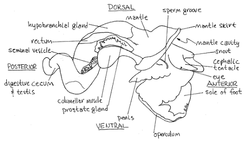
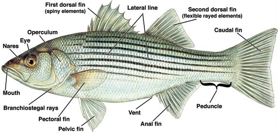
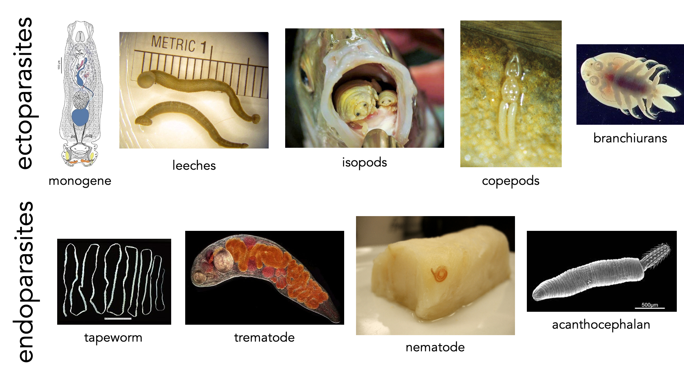
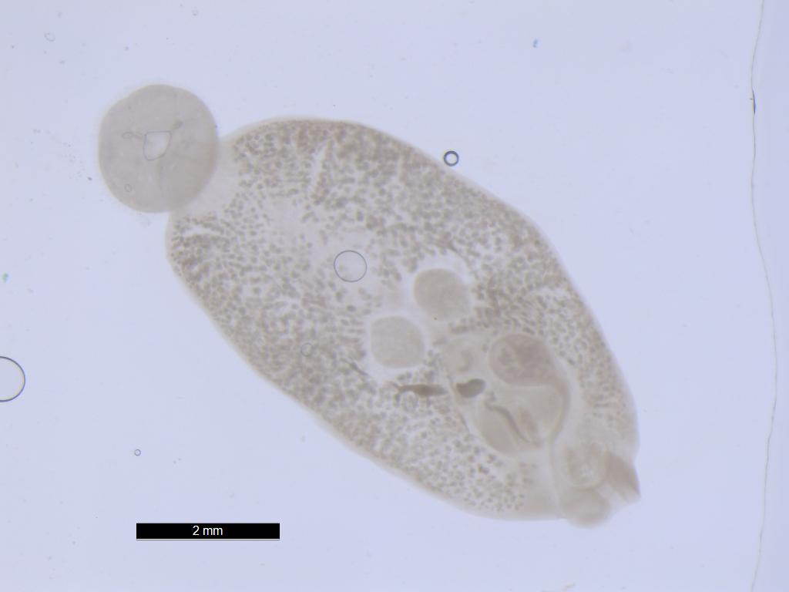
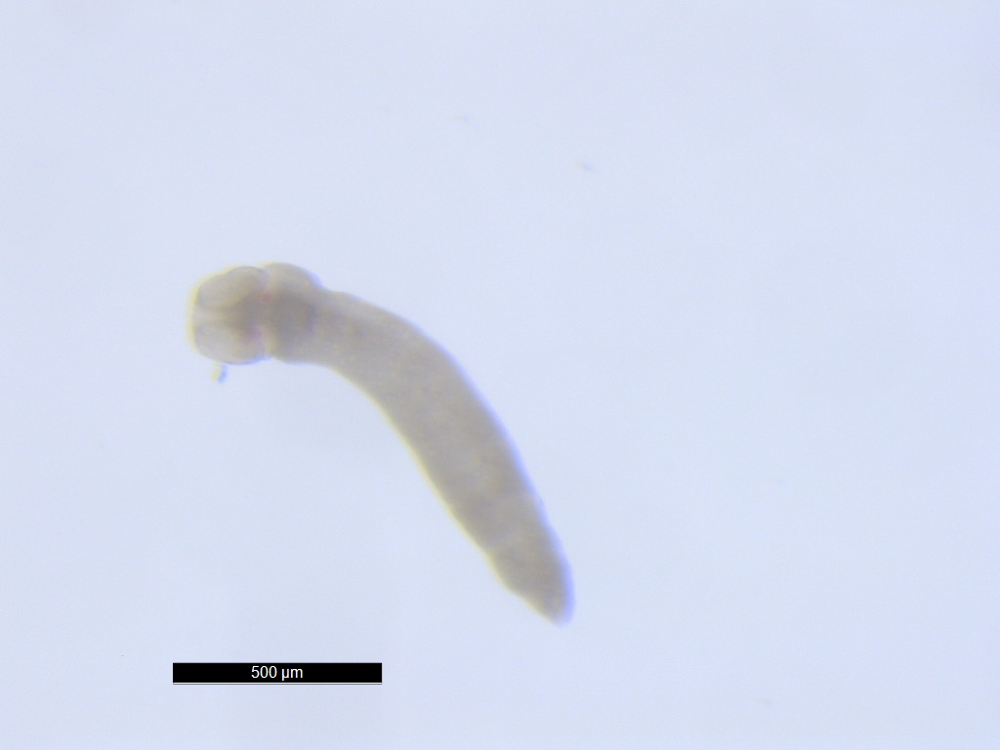
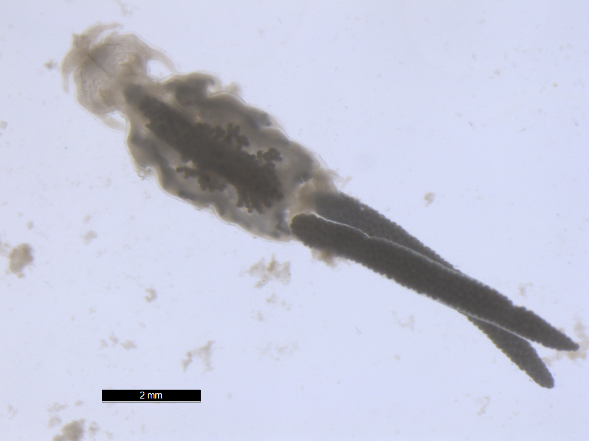
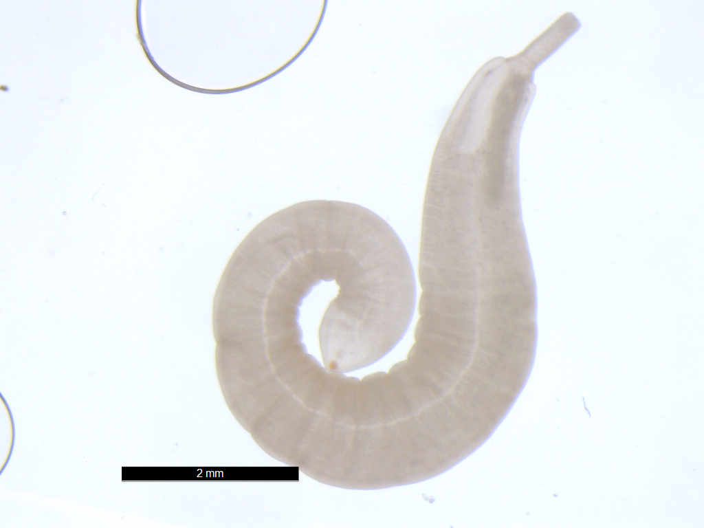
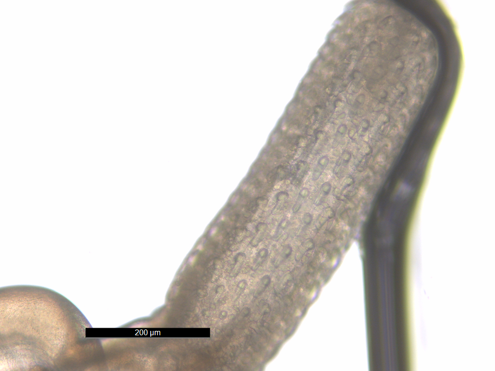

 

#

**Make sure to read, watch, or listen to all content on each tab before the corresponding class or lab!**

These materials were adapted from Kuris, Whitney, and McKenzie Parasitology Lab Exercises, UC Santa Barbara.

Note that *Schistosoma*-infected mice were provided by the NIAID Schistosomiasis Resource Center for distribution through BEI Resources, NIH-NIAID Contract HHSN272201000005I (NIH: Schistosoma mansoni, Strain NMRI, Exposed Swiss Webster Mice, NR-21963)

 

# Classes

### Class 1

### Class 2

### Class 3

### Class 4

### Class 5

### Class 6

### Class 7

### Class 8

### Class 9

### Class 10

### Class 11

### Class 12

### Class 13

### Class 14

### Class 15

### Class 16

### Class 17

### Class 18

### Class 19

### Class 20

### Class 21

### Class 22

### Class 23

### Class 24

### Class 25

### Class 26

# Labs

### Lab 1

**It'll be barely visible at first: a twitch.** A white mouse will be laid on its back on your desk, pinned to a wax tray, its organs exposed.Itself freshly dead, the mouse’s schistosome parasites will still be alive. Just within the hepatic portal vein and visible across the thin wall of the vessel, paired male and female worms will thrash, sensing their host’s demise.When I see this, I'm always awestruck at the devastation wreaked on the liver by wayward *Schistosoma mansoni* eggs, at the organ’s distention, its mounds of granulomas. I'm also awestruck at the thought that such eggs are – at this very moment – navigating the same winding route through human bodies, causing the same pathology.

[https://img.youtube.com/vi/ffsV86ytjSM/0.jpg](https://www.youtube.com/watch?v=ffsV86ytjSM)



This year, I'll kick off our labs by throwing you into the deep end of the parasitology pool. In our first lab, you will get to see **live schistosome adults in mice and hatch their eggs into miracidia.** You'll also get to see **another species of trematode in its snail intermediate host**. For this and all future labs, you'll be responsible for keeping a laboratory notebook of your observations. Make sure to finish reading the content on Lab 1 before your lab section meets!

    Phylum Platyhelminthes
            Class Trematoda
                  Subclass Digenea
                        Order Strigeiformes
                            Family Schistosomatidae
                                  *Schistosoma mansoni*
                                  *Schistosoma haematobium*
                                  *Schistosoma japonicum*
                        Order Plagiorchiida
                            Family Heterophyidae
                                  *Cercaria batillariae*

 

#### Phylum Platyhelminthes

The platyhelminths are commonly referred to as "flatworms", since they are typically dorsoventrally flattened. This large and diverse phylum is comprised of four major classes (Turbellaria, Trematoda, Monogenea, and Cestoidea) that we will study in more depth throughout the next few labs. The hypothetical relationships of these major groups are shown in the cladogram below, which traces the common ancestry among the groups. The platyhelminths as a group provide an exciting introduction to parasitology because one can trace the evolution and specialization for parasitism throughout the group. While studying the flatworms, pay particular attention to the reproductive anatomy, reproductive capacity, adaptations for a parasitic life style, and transmission stages.

    

 

#### The trematode life cycle 

The digenetic trematodes comprise a truly marvelous array of families, genera, and species. Classification of the Digenea is determined on the basis of the size, shape, and placement of suckers, arrangement of flame cells, and especially on details of the reproductive system. The Digenea are one of the largest platyhelminth groups, with an estimated 40,000 described species in at least 125 families. Taxonomy in this large group is still in a dynamic state.

The majority of the Digenea are equipped with two muscular suckers. The largest of these, the acetabulum (ventral sucker), is located on the ventral surface of the worm and serves as an attachment structure. The oral sucker surrounds the mouth and is located at the anterior end of the worm. Most digenes are less than 30 mm in length and many species are less than 3 mm. On the other hand, Hirudinella, a species found in the stomach of some marine fish species, may attain the length and girth of a summer squash.  Here's a video of an adult Hirudinella marina, which Chelsea dissected from the stomach of a pelagic wahoo (please forgive the way the camera moves and the noise in the background - this video was taken on a sailing research vessel on the high seas!):

https://www.youtube.com/watch?v=q8MpczbOYUE&embeds_referring_euri=https%3A%2F%2Fcanvas.uw.edu%2Fcourses%2F1479012%2Fpages%2Flab-1-overview-part-1-flatworms-and-the-trematode-life-cycle%3Fmodule_item_id%3D13387537&source_ve_path=MzY4NDIsMjg2NjY

The ordinal name, Digenea, refers to the fact that the life cycle of these flatworms involves an alternation of hosts, with asexual reproduction occurring in intermediate hosts. As many as three intermediate hosts and a single definitive host may be required to complete a digenetic trematode life cycle. The first intermediate host is typically a gastropod (snail). The definitive host is always a vertebrate. Asexual reproduction in parasites may occur in intermediate hosts; sexual reproduction (cross-fertilization of the hermaphroditic worms) occurs only in the definitive host.

Adult digenetic trematodes (known as “flukes” in the common vernacular) are typically found in the digestive tract and associated viscera of definitive hosts but may be found in almost any organ or tissue. The vertebrate definitive hosts typically have high vagility (i.e., they move across long distances), which facilitates the distribution of parasite eggs. All vertebrate classes serve as hosts to these parasites. Digenetic trematodes are economically and medically significant, as some species cause serious pathology in domestic animals and humans.

The digenetic trematodes have some of the most complicated life histories in the animal kingdom. Digenetic trematode life cycles are “indirect” or “complex”, meaning that more than one host species is required to complete the life cycle. All species have asexually and sexually reproducing life states and a minimum of two hosts: a **first intermediate host** and a **definitive host**. Many taxa incorporate a second or third intermediate host as well.  Although this may, at first, seem confusing, there are really two basic variations to the theme as follows:

1. Taxa that have an intermediate host (usually a snail) and a definitive host (vertebrate) only.
2. Taxa that incorporate additional intermediate hosts (which may be mollusks, annelids, arthropods, or vertebrates) between the first intermediate and definitive hosts.

 

    

 

Asexual reproduction occurs in the intermediate host. Sexual reproduction, resulting in the production of eggs, occurs only in the definitive host. There are three distinct larval stages involved in all digenetic trematode life cycles: the **miracidium**, **sporocyst**, and **cercaria**. Some taxa also produce **rediae** and/or encysted **metacercariae**. All of these life stages except for the miracidium can be found in first intermediate hosts. One of the many interesting aspects of digenetic trematode parasite life cycles is the parasitic castration of the first intermediate host. Parasitic castration is the elimination of reproductive capability in the host, and results from consumption of and interference with the gonad tissue by larval digenetic trematode parasites. The castrated host continues to live and compete with uninfected individuals in the host population, but only produces larval parasites.

**Miracidium:** The miracidium is the larval stage that develops within the egg produced by the adult fluke in the definitive host. After hatching from the egg, miracidia are infective to the first intermediate host. The miracidium is a minute, ovoid, aquatic, motile stage covered with cilia. These cilia are shed when infection is initiated by penetration of the host or consumption of embyronated eggs by an appropriate host. In the video below, you will see a miracidium (of the trematode species Fasciola hepatica) hatching out of its egg, using its cilia to swim away, and leaving behind an empty eggshell:

https://youtu.be/78u7YKKPEKY

**Sporocyst:** Infection of the first intermediate hosts begins when the miracidium enters that host and becomes a primary or “mother” sporocyst. The primary sporocyst gives rise to a second generation asexually; the second generation may be daughter sporocysts or rediae. Embryos within the daughter sporocysts may produce another generation of sporocysts, rediae, or cercariae. Sporocysts are “sack-like” organisms with no mouth or digestive system. The sporocyst absorbs nutrients directly from host tissue to supply the developing larvae. 

**Rediae:** SOME groups of digeneans produce rediae. Rediae have a rudimentary digestive system consisting of a mouth, muscular pharynx, and short, unbranched gut; this larval stage may be distinguished from a sporocyst based on the presence of these structures. Rediae can be quite active and even downright aggressive, feeding actively on host tissue and sometimes upon other larval trematodes within the host. Note that not all digenean trematodes possess a redia stage – some only produce sporocysts.

**Cercariae:** Cercariae are asexually produced by sporocysts or rediae, depending on the species of trematode. Cercariae are free-swimming, sperm-like creatures that encyst in or penetrate the next host. Three different scenarios are possible:

1. Penetration of a second intermediate host and development of an encysted stage (metacercaria) in that host.
2. Penetration of the definitive (vertebrate) host and development of the adult fluke in that host.
3. Encysting on a suitable substrate in the environment or on the outside of an intermediate host.

In the video below, you can see cercariae spilling out of burst sporocysts dissected from a snail intermediate host (note that you can see the ventral suckers clear as day on each cercaria!):

https://youtu.be/d3wced1DQd4

**Metacercariae:** The metacercaria is an encysted larval stage that occurs in many digenean life cycles. Metacercariae are infective to the definitive host in the life cycle. Infection of the definitive host by a metacercaria is always trophic: the definitive host consumes the metacercariae in an infected intermediate host or on food items. Metacercaria can develop in both invertebrate and vertebrate hosts and on invertebrates. The developing fluke may be visible inside of the cyst (as in the illustration below):

 

    

 

Having trouble keeping track of the trematode life cycle?  *The Oatmeal* is here to help! [This cartoon](https://theoatmeal.com/comics/captain_higgins) illustrates the three-host life cycle of one trematode (*Dicrocoelium dendriticum*) in a... memorable... way.

 

#### Order Strigeiformes

The Order Strigeiformes is pretty unique among the trematodes: instead of a three-host life cycle, the Srigeiformes use only two hosts (a first intermediate snail and a vertebrate definitive host). The Order Srigeiformes includes those digene species whose cercariae have forked tails. The cercariae also possess specialized glands for penetration of the hosts. The digenetic trematodes in the Superfamily Schistosomatoidea are usually **dioecious**, having separate male and female worms. The schistosomes are our representative material for this order, but they are **unusual in many ways and highly adapted for parasitism**. Adult worms live permanently in copula within the host.

 

    
    <em>Image courtesy of [CDC DPDx](https://www.cdc.gov/dpdx/schistosomiasis/index.html)</em>

 

Schistosomes are long, thin worms, an adaptation to living in the small blood vessels of the mammalian hepatic portal system. The **oral sucker** and **acetabulum** are adjacent in these worms. The male is recognized by the presence of the **gynecophoric canal**, a deep groove on the ventral surface that holds the female worm. The testis is also usually visible in stained specimens. The **genital pore** is just posterior to the acetabulum in the female worm. Lateral **vitellaria** occupy the posterior half of the body and the compact ovary is previtelline. The digestive **caecae** are usually visible as dark coiled tubes. What are these worms eating?

 

    
    <em>Image from [Boissier et al. 2019](https://www.researchgate.net/publication/337592635_Schistosoma_spp#fullTextFileContent)</em>

 

Schistosome cercariae are fork-tailed.  Once released from their snail hosts, they swim through the water column, seeking out a vertebrate definitive host.  In the case of *Schistosoma mansoni* and *Schistosoma haematobium*, the definitive hosts are human, and they infect human hosts by penetrating the skin of people bathing in streams, rivers, lakes, and ponds containing snails.  In lab, you will see only the adult and egg stages of this parasite, not the cercariae (even though the Wood Lab does keep living schistosome cercariae in its biosafety-level 2 facility).  Why am I not giving you schistosome cercariae to handle?

(https://youtu.be/vIfkRAdMvsE)

 

#### Demonstration instructions

##### *Schistosoma mansoni* adults in the vertebrate definitive host

Schistosomiasis (human infection with schistosome worms) is a debilitating disease, rarely killing but often disabling infected individuals. Today we will see the destructiveness of schistosomes firsthand. The US National Institutes of Health maintains the life cycle of *Schistosoma mansoni* in their laboratories near Washington, DC, using *Biomphalaria glabrata* snails as intermediate hosts and laboratory mice as definitive hosts. They provide infected mice to research and teaching laboratories around the country. We have access to these infected animals for our teaching laboratory. These mice gave their lives for science, so please treat them with respect.

Mice are great models for human schistosomiasis. Much of the schistosome-related pathology suffered by the mice is closely mirrored in human (and other vertebrate) patients. Five weeks ago, the mice you see before you were exposed to water with active *Schistosoma mansoni* cercariae. They were then shipped to UW, and we held them for six weeks, while their S. mansoni parasites developed. Some of these mice may be uninfected, but most will carry extremely heavy infections.

* Begin by performing an external examination of your mouse. Do you see anything unusual or notable? Measure your mouse’s length, from snout to rear and from snout to tail tip.
* Lay your mouse on its back and begin by making an incision from the anus to the throat using the small scissors. Keep your incision shallow to avoid damaging internal organs.
* Pin out the flaps of skin on either side of the mouse, exposing the body cavity.
* Observe and draw the internal organs. Note anything unusual.
* Compare the liver and intestines of the infected mouse to pictures of healthy mice (see below). What pathology do you observe in the infected mouse? The white spots on the liver of the infected animal are granulomas. Encapsulation of schistosome eggs by the host causes granulomas. What is the consequence to the host? How did the eggs get into the liver? * Where should they be?
* Now use your dissecting scope to explore the internal organs more closely. The adult worms are visible in the portal veins of your mouse.
* Once you have finished drawing your host, remove its parasites. Tease apart the organs to access the portal veins. * * * Breach the portal vein to pull out the worm, or pull out the entire vein.
* Place adult worms into Ringers’ solution. Can you differentiate between the male and female worms? Describe any movement or behavior that you see in these living specimens. Draw both the adults and eggs.
* Many of these worms will have ripe eggs. Any student who is able to obtain a miracidium will be awarded +3 points on the next exam. Hint: what kind of fluid will trigger hatching in a schistosome egg?
* The prominent lateral spine is diagnostic for this species. The eggs of Schistosoma japonicum have a less prominent spine and those of haematobium are terminal. How are spined eggs an adaptation for these worms? Most helminth parasite infections in humans are diagnosed by the presence of characteristic eggs in the feces or urine. You should be able to identify schistosome eggs on the exam.

 

    
    <em>(left) healthy mouse (right) mouse infected with *Schistosoma mansoni*</em>

 

##### *Cercaria batillariae* larvae in the snail intermediate host

The Japanese mud snail Batillaria attramentaria is native to Japan but was introduced to the US west coast in the early 1900s, probably in shipments of Asian oysters.In California, it has driven out a native mud snail, *Cerithidea californica*, in part because Batillaria has only one parasite (Cercaria batillariae), whereas Cerithidea can have up to 20! Greg Jensen collected these snails in mid-September from the intertidal zone in Silverdale, WA.

Please familiarize yourself with gastropod internal anatomy before you begin the dissection:

    
    <em></em>

Place three snails in a beaker of seawater. Add just enough water to cover the tops of their shells. Give them a few minutes, then remove the snails into a watchglass. Check the water for tiny, swimming cercariae with the naked eye. Place the water from the beaker into a watch glass and check closely with a stereomicroscope for cercariae.

Place one snail on the benchtop. Take a total length measurement (the longest dimension of the shell) and record this in your lab notebook. Crack the spire with a hammer (gently) to reveal the snail. Put the snail in a watchglass and moisten the animal with seawater. Carefully remove the shell pieces for better viewing and examine the animal under a dissecting scope. Infection may or may not be immediately apparent. The visceral hump (the spiral organ that contains the digestive gland and gonads) is the narrow, “corkscrew” extremity of the snail. If the visceral hump is whitish, tan, or mottled, the snail is probably infected with trematodes. If it is dark green or gold, the snail may be uninfected.

Examine the gonad for sporocysts and/or rediae. If you don’t see any at first, tear the tissue with forceps to examine the deeper tissues.

Draw any cercariae, rediae, or sporcysts that you find and record your observations. Have your TA check your snail for infection before you dispose of it! Record your snail data on the board (remember that zeros are data, too).

**Note:** If you do not succeed in finding an infection in your snails, please dissect another one or observe another student’s infected snail.

 

#### Questions

Please answer the following questions in your lab notebook:

1. How does the intensity of infection affect pathology in **Schistosoma mansoni** infection? Is prevalence a useful statistic for studying the epidemiology of schistosomes in the definitive host?
2. What is the most challenging aspect of adapting successfully to somatic endoparasitism?
3. Which larval stage (or stages) is/are infective to the vertebrate host? To the snail host?
4. How is parasitic castration an adaptive strategy for trematodes? What are the possible costs of this strategy?
5. Our lab keeps plenty of **Schistosoma mansoni**-infected **Biomphalaria** snails in a biosafety-level 2 containment facility in the Portage Bay Building right here on campus. Why didn't we bring you any to dissect?

 

[DON'T FORGET TO PASTE PANOPTO VIDEOS HERE]

### Lab 2

**Readings:** *How to Do Ecology,* Chapter 1

Now that you’ve done a deep dive into the trematodes, let’s take a broader view: we’ll check out a diversity of parasites from marine and freshwater fishes, covering monogenes, trematodes, cestodes, nematodes, acanthocephalans, and crustaceans. 

When I first started learning about parasites, I thought about them as "out there" - out in nature, out in the Global South, away from me.I could not have been more wrong. Parasites are around us, all the time, hidden just under the surface of everything that is familiar - your friends, your pets, even your food.  

To prove it to you, we're going to do some grocery store parasitology. 

    
    <em></em>

When you arrive at your lab section this week, you will be provided with one whole, ungutted, wild (not farm-raised) fish acquired from a local seafood market. We'll make note of the common name given by the seafood market, so that we can look up the Latin name for your lab notebook.Let's see what kinds of worms are lurking in the seafood aisle!

 

#### Demonstration instructions

Parasitology is a “blood and guts” subject. Dissection of freshly killed host organisms provides the best material for examining living parasites. In this lab, you will be examining and dissecting freshly collected teleost fishes. Fishes serve as intermediate and/or definitive hosts for a diversity of parasite taxa. If you are careful and observant, you may find many parasites in and on your specimens. Take your time as you examine the fish/host – **it will take some practice to develop a search image and many of the parasites are small**! Check out the representative drawings of fish parasite taxa before you proceed. Internal anatomy is very consistent across the vertebrates, and fish host many of the same types of parasites that are found in people (even some that may infect people!).

 

##### Fish dissection procedure

**Before you dissect:**

1. Collect the fish and place it on a dissection tray for easier clean-up.
2. Determine the species of the fish that you will dissect. Record the collection data (common name, Latin name, store it was obtained from, whether it is wild or farmed, where the seafood market told you it was from, date purchased) in your lab notebook.
3. Take the total length, standard length, and fork length measurements of the fish. Record this measurement in your lab notebook (always use metric units).

 

    
    <em></em>

 

**Ectoparasite assay:**

1. Consult the figure above to familiarize yourself with the external anatomy of the fish.
2. Refer to the figure below to develop a search image for some of the parasites that you may find; pay attention to the size ranges given. Which types of parasites should be easily visible without magnification?
3. Carefully examine the skin, fin rays, and lateral line of the fish for copepods, branchiurans, isopods, leeches, and monogenes. Remove the fins with scissors and use the dissecting scope to examine the tissue more closely.
4. Look in the mouth of the fish and probe the nasal capsules for parasites.
5. Examine the gill arches in situ. Remove the gill arches with scissors and examine the gill filaments carefully under the dissecting scope for monogenes.

    
    <em></em>

    
    <em></em>

 

**Endoparasite assay:**

1. Consult the figure above to familiarize yourself with the internal anatomy of the fish.
2. Use a scissor to make a cut on the abdomen of your fish from the vent/anus/cloaca to the operculum and slightly off the midline so that you do not cut through the digestive tract. Make several shallow cuts so that you do not puncture internal organs.
3. Using the scalpel and/or scissors, make two cuts through the skin and subcutaneous musculature, perpendicular to the first incision; make one cut behind the operculum and one in front of the cloaca form the abdomen to the spine.
4. Open this flap of skin and muscle or remove it to examine the internal organs (be careful not to sever the cloaca).
5. Determine the sex and reproductive status of your fish (if possible) and record these data.
6. Carefully remove the digestive tract (esophagus to cloaca) and put it in a dish.
7. Identify the organs of the digestive tract, proceeding from mouth to cloaca.
8. Examine the body cavity and mesenteries for nematodes and cestodes.
9. Identify and remove the gall bladder; place it in a watch glass with seawater.
10. Carefully open the stomach and examine it for parasitic nematodes. Record any stomach contents found.
11. Open the intestine and examine it for adult nematodes, cestodes, and acanthocephalans. These parasites may be seen without magnification but you will need to use the dissecting scope to look for trematodes. Use a squirt bottle of seawater to clear the specimen for viewing but be sure to check the tray for escapees.
12. Examine the muscles of your fish for encysted nematodes and cestodes.

**Documenting your observations**

1. You may want to sketch the parasites in situ in the host – these drawings provide great study material.
2. Remove the parasites that you find and place them in glass dishes with seawater. Record the site of infection, number of each taxon found, and other pertinent data in your lab notebook for each parasite.
3. Sketch the parasite/s (include size or magnification).
4. Make sure to confirm your identifications of any parasites you find with your instructor.
5. Make sure to count up the number of parasites of each taxon that you find.
6. Remember to record your observations on the white board. With data from across the entire class, we will be able to compare and contrast the number of parasites and the number of species of parasites across different kinds of hosts.

 

#### Slides to examine

In this lab and all the labs to follow, there will be slides for you to examine. **"But why,"** you wonder, **"should I look at slides when I can just find pictures of these organisms on the internet?"** I'll let you in on a parasitology secret: **photographs do not capture all of the nuance, detail, and beauty of the parasites.** Photographs are one-dimensional, but parasites are three-dimensional; that is to say, photographs can only bring a single plane into focus, but because parasites are 3D, there are many other planes where interesting stuff is going on. When you focus on a microscope slide, you can bring the deepest plane into focus, and then the next deepest, and so on to the shallowest plane, and in that way, what you see (and what you draw) is better than a photograph.

You are welcome to take photos of what you see in lab if it helps you learn, understand, and remember. But **I require all students to *draw, draw, draw* because it is the best way to truly *see* the parasites.** There is something about the act of your hand making a drawing that lets your eye see more than it otherwise would. Try it for yourself and you'll notice things that you've never seen before!

**Slides to examine:**

* Eggs
* Miracidiae
* Sporocysts
* Rediae (note pharynx and short gut)
* Cercariae
* Metacercariae
* Adult of *Platynosoumum fastosum, Dicrocoelium dendriticum* (incorrectly labeled as *D. lanceatum*), *Clonorchis sinensis, Heterophyes heterophyes,* or *Gastrothylax elongatus*

 

#### Lab 2 preview

**Want a sneak peak of this week's lab?** Check out the images below of the parasites that previous generations of FISH 406 students have found in their grocery store fish.

 

    
    <em>Monogenean parasite from gills of kinki rockfish (*Sebastolobus alascanus*)</em>
    <em></em>

 

    
    <em>Opisthaptor of monogenean parasite from gills of kinki rockfish (*Sebastolobus alascanus*)</em>
    <em></em>

 

    
    <em>Tapeworm larva (plerocercoid) from intestine of kinki rockfish (*Sebastolobus alascanus*)</em>
    <em></em>

 

    
    <em>Nematode larva from body cavity of kinki rockfish (*Sebastolobus alascanus*)</em>
    <em></em>

 

    
    <em>Nematode adult from intesine of kinki rockfish (*Sebastolobus alascanus*)</em>
    <em></em>

 

    
    <em>Copepod parasite from gills of kinki rockfish (*Sebastolobus alascanus*)</em>
    <em></em>

 

    
    <em>Copepod parasite (family Pennellidae) from gills of kinki rockfish (*Sebastolobus alascanus*), courtesy of Matt Wilson</em>
    <em></em>

 

[MATT WILSON'S VIDEO]

    
    <em>Acanthocephalan parasite from intestines of kinki rockfish (*Sebastolobus alascanus*)</em>
    <em></em>

 

    
    <em>Proboscis of acanthocephalan parasite from intestines of kinki rockfish (*Sebastolobus alascanus*)</em>
    <em></em>

 

[MATT WILSON CLAVINEMA VIDEO]

 

### Lab 3

**I have a confession to make:** of all the parasites, the cestodes are my favorites. I first fell in love with them when I was dissecting a pelagic fish aboard a sailing research vessel, and I found this:

[SEAMANS VIDEO]

What you're seeing above is a tapeworm larva in the Order Trypanorhyncha. These guys reach their adult life stage in the guts of sharks. This larval plerocercoid was laying in wait inside a tuna, hoping that its tuna host would deliver itself into the jaws of a shark so that it could fulfill its tapeworm destiny to mate and produce eggs in a shark intestine. The tiny tentacles that you see reaching out to you are armed with hundreds of rows of backward-facing spikes. These tentacles are used to attach the worm to the inside of the shark intestine.

Not only do the cestodes have super complex life cycles, but their body forms are wildly diverse, and they are just **heartbreakingly, staggeringly beautiful**. You'll get to see that for yourself in this lab. We'll have one species of cestodes for you to discover very much alive. I hope you'll come to love the tapeworms as much as I do.

During this lab, we'll also chat with you about the parasite species you're thinking about researching for your term paper and elevator pitch. Remember that you'll need to develop a plan to control, eliminate, eradicate, or augment your parasite, and you'll need to support your proposed plan with evidence and logic. Our conversation about this will be short this week - we just want to make sure that everyone has at least one potential parasite species in mind, and that not everyone has chosen the same parasite species! But do come to lab with some ideas about parasite species you might be interested in researching.

### Lab 4

### Lab 5

### Lab 6

### Lab 7

### Lab 8

### Lab 9

 