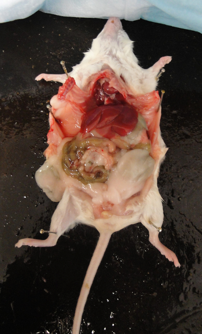

<br>

#

Make sure to read, watch, or listen to all content on each tab before the corresponding class or lab!

<br>


# Classes

### Class 1

### Class 2

### Class 3

### Class 4

### Class 5

### Class 6

### Class 7

### Class 8

### Class 9

### Class 10

### Class 11

### Class 12

### Class 13

### Class 14

### Class 15

### Class 16

### Class 17

### Class 18

### Class 19

### Class 20

### Class 21

### Class 22

### Class 23

### Class 24

### Class 25

### Class 26

# Labs

### Lab 1

**It'll be barely visible at first: a twitch.** A white mouse will be laid on its back on your desk, pinned to a wax tray, its organs exposed.Itself freshly dead, the mouse’s schistosome parasites will still be alive. Just within the hepatic portal vein and visible across the thin wall of the vessel, paired male and female worms will thrash, sensing their host’s demise.When I see this, I'm always awestruck at the devastation wreaked on the liver by wayward *Schistosoma mansoni* eggs, at the organ’s distention, its mounds of granulomas. I'm also awestruck at the thought that such eggs are – at this very moment – navigating the same winding route through human bodies, causing the same pathology.

[https://img.youtube.com/vi/ffsV86ytjSM/0.jpg](https://www.youtube.com/watch?v=ffsV86ytjSM)


```

This year, I'll kick off our labs by throwing you into the deep end of the parasitology pool. In our first lab, you will get to see **live schistosome adults in mice and hatch their eggs into miracidia.** You'll also get to see **another species of trematode in its snail intermediate host**. For this and all future labs, you'll be responsible for keeping a laboratory notebook of your observations. Make sure to finish reading the content on Lab 1 before your lab section meets!

*Adapted from Kuris, Whitney, and McKenzie Parasitology Lab Exercises, UC Santa Barbara*

*Note that Schistosoma-infected mice were provided by the NIAID Schistosomiasis Resource Center for distribution through BEI Resources, NIH-NIAID Contract HHSN272201000005I (NIH: Schistosoma mansoni, Strain NMRI, Exposed Swiss Webster Mice, NR-21963)*

    Phylum Platyhelminthes
            Class Trematoda
                  Subclass Digenea
                        Order Strigeiformes
                            Family Schistosomatidae
                                  *Schistosoma mansoni*
                                  *Schistosoma haematobium*
                                  *Schistosoma japonicum*
                        Order Plagiorchiida
                            Family Heterophyidae
                                  *Cercaria batillariae*

  
#### Phylum Platyhelminthes

The platyhelminths are commonly referred to as "flatworms", since they are typically dorsoventrally flattened. This large and diverse phylum is comprised of four major classes (Turbellaria, Trematoda, Monogenea, and Cestoidea) that we will study in more depth throughout the next few labs. The hypothetical relationships of these major groups are shown in the cladogram below, which traces the common ancestry among the groups. The platyhelminths as a group provide an exciting introduction to parasitology because one can trace the evolution and specialization for parasitism throughout the group. While studying the flatworms, pay particular attention to the reproductive anatomy, reproductive capacity, adaptations for a parasitic life style, and transmission stages.

<p align="center">
    
</p>

#### The trematode life cycle 

The digenetic trematodes comprise a truly marvelous array of families, genera, and species. Classification of the Digenea is determined on the basis of the size, shape, and placement of suckers, arrangement of flame cells, and especially on details of the reproductive system. The Digenea are one of the largest platyhelminth groups, with an estimated 40,000 described species in at least 125 families. Taxonomy in this large group is still in a dynamic state.

The majority of the Digenea are equipped with two muscular suckers. The largest of these, the acetabulum (ventral sucker), is located on the ventral surface of the worm and serves as an attachment structure. The oral sucker surrounds the mouth and is located at the anterior end of the worm. Most digenes are less than 30 mm in length and many species are less than 3 mm. On the other hand, Hirudinella, a species found in the stomach of some marine fish species, may attain the length and girth of a summer squash.  Here's a video of an adult Hirudinella marina, which Chelsea dissected from the stomach of a pelagic wahoo (please forgive the way the camera moves and the noise in the background - this video was taken on a sailing research vessel on the high seas!):

https://www.youtube.com/watch?v=q8MpczbOYUE&embeds_referring_euri=https%3A%2F%2Fcanvas.uw.edu%2Fcourses%2F1479012%2Fpages%2Flab-1-overview-part-1-flatworms-and-the-trematode-life-cycle%3Fmodule_item_id%3D13387537&source_ve_path=MzY4NDIsMjg2NjY

The ordinal name, Digenea, refers to the fact that the life cycle of these flatworms involves an alternation of hosts, with asexual reproduction occurring in intermediate hosts. As many as three intermediate hosts and a single definitive host may be required to complete a digenetic trematode life cycle. The first intermediate host is typically a gastropod (snail). The definitive host is always a vertebrate. Asexual reproduction in parasites may occur in intermediate hosts; sexual reproduction (cross-fertilization of the hermaphroditic worms) occurs only in the definitive host.

Adult digenetic trematodes (known as “flukes” in the common vernacular) are typically found in the digestive tract and associated viscera of definitive hosts but may be found in almost any organ or tissue. The vertebrate definitive hosts typically have high vagility (i.e., they move across long distances), which facilitates the distribution of parasite eggs. All vertebrate classes serve as hosts to these parasites. Digenetic trematodes are economically and medically significant, as some species cause serious pathology in domestic animals and humans.

The digenetic trematodes have some of the most complicated life histories in the animal kingdom. Digenetic trematode life cycles are “indirect” or “complex”, meaning that more than one host species is required to complete the life cycle. All species have asexually and sexually reproducing life states and a minimum of two hosts: a **first intermediate host** and a **definitive host**. Many taxa incorporate a second or third intermediate host as well.  Although this may, at first, seem confusing, there are really two basic variations to the theme as follows:

1. Taxa that have an intermediate host (usually a snail) and a definitive host (vertebrate) only.
2. Taxa that incorporate additional intermediate hosts (which may be mollusks, annelids, arthropods, or vertebrates) between the first intermediate and definitive hosts.

<p align="center">
    
</p>

Asexual reproduction occurs in the intermediate host. Sexual reproduction, resulting in the production of eggs, occurs only in the definitive host. There are three distinct larval stages involved in all digenetic trematode life cycles: the **miracidium**, **sporocyst**, and **cercaria**. Some taxa also produce **rediae** and/or encysted **metacercariae**. All of these life stages except for the miracidium can be found in first intermediate hosts. One of the many interesting aspects of digenetic trematode parasite life cycles is the parasitic castration of the first intermediate host. Parasitic castration is the elimination of reproductive capability in the host, and results from consumption of and interference with the gonad tissue by larval digenetic trematode parasites. The castrated host continues to live and compete with uninfected individuals in the host population, but only produces larval parasites.

**Miracidium:** The miracidium is the larval stage that develops within the egg produced by the adult fluke in the definitive host. After hatching from the egg, miracidia are infective to the first intermediate host. The miracidium is a minute, ovoid, aquatic, motile stage covered with cilia. These cilia are shed when infection is initiated by penetration of the host or consumption of embyronated eggs by an appropriate host. In the video below, you will see a miracidium (of the trematode species Fasciola hepatica) hatching out of its egg, using its cilia to swim away, and leaving behind an empty eggshell:

Asexual reproduction occurs in the intermediate host. Sexual reproduction, resulting in the production of eggs, occurs only in the definitive host. There are three distinct larval stages involved in all digenetic trematode life cycles: the miracidium, sporocyst, and cercaria. Some taxa also produce rediae and/or encysted metacercariae. All of these life stages except for the miracidium can be found in first intermediate hosts. One of the many interesting aspects of digenetic trematode parasite life cycles is the parasitic castration of the first intermediate host. Parasitic castration is the elimination of reproductive capability in the host, and results from consumption of and interference with the gonad tissue by larval digenetic trematode parasites. The castrated host continues to live and compete with uninfected individuals in the host population, but only produces larval parasites.

Miracidium: The miracidium is the larval stage that develops within the egg produced by the adult fluke in the definitive host. After hatching from the egg, miracidia are infective to the first intermediate host. The miracidium is a minute, ovoid, aquatic, motile stage covered with cilia. These cilia are shed when infection is initiated by penetration of the host or consumption of embyronated eggs by an appropriate host. In the video below, you will see a miracidium (of the trematode species Fasciola hepatica) hatching out of its egg, using its cilia to swim away, and leaving behind an empty eggshell:

Asexual reproduction occurs in the intermediate host. Sexual reproduction, resulting in the production of eggs, occurs only in the definitive host. There are three distinct larval stages involved in all digenetic trematode life cycles: the miracidium, sporocyst, and cercaria. Some taxa also produce rediae and/or encysted metacercariae. All of these life stages except for the miracidium can be found in first intermediate hosts. One of the many interesting aspects of digenetic trematode parasite life cycles is the parasitic castration of the first intermediate host. Parasitic castration is the elimination of reproductive capability in the host, and results from consumption of and interference with the gonad tissue by larval digenetic trematode parasites. The castrated host continues to live and compete with uninfected individuals in the host population, but only produces larval parasites.

Miracidium: The miracidium is the larval stage that develops within the egg produced by the adult fluke in the definitive host. After hatching from the egg, miracidia are infective to the first intermediate host. The miracidium is a minute, ovoid, aquatic, motile stage covered with cilia. These cilia are shed when infection is initiated by penetration of the host or consumption of embyronated eggs by an appropriate host. In the video below, you will see a miracidium (of the trematode species Fasciola hepatica) hatching out of its egg, using its cilia to swim away, and leaving behind an empty eggshell:

https://youtu.be/78u7YKKPEKY

**Sporocyst:** Infection of the first intermediate hosts begins when the miracidium enters that host and becomes a primary or “mother” sporocyst. The primary sporocyst gives rise to a second generation asexually; the second generation may be daughter sporocysts or rediae. Embryos within the daughter sporocysts may produce another generation of sporocysts, rediae, or cercariae. Sporocysts are “sack-like” organisms with no mouth or digestive system. The sporocyst absorbs nutrients directly from host tissue to supply the developing larvae. 

**Rediae:** SOME groups of digeneans produce rediae. Rediae have a rudimentary digestive system consisting of a mouth, muscular pharynx, and short, unbranched gut; this larval stage may be distinguished from a sporocyst based on the presence of these structures. Rediae can be quite active and even downright aggressive, feeding actively on host tissue and sometimes upon other larval trematodes within the host. Note that not all digenean trematodes possess a redia stage – some only produce sporocysts.

**Cercariae:** Cercariae are asexually produced by sporocysts or rediae, depending on the species of trematode. Cercariae are free-swimming, sperm-like creatures that encyst in or penetrate the next host. Three different scenarios are possible:

1. Penetration of a second intermediate host and development of an encysted stage (metacercaria) in that host.
2. Penetration of the definitive (vertebrate) host and development of the adult fluke in that host.
3. Encysting on a suitable substrate in the environment or on the outside of an intermediate host.

In the video below, you can see cercariae spilling out of burst sporocysts dissected from a snail intermediate host (note that you can see the ventral suckers clear as day on each cercaria!):

https://youtu.be/d3wced1DQd4

**Metacercariae:** The metacercaria is an encysted larval stage that occurs in many digenean life cycles. Metacercariae are infective to the definitive host in the life cycle. Infection of the definitive host by a metacercaria is always trophic: the definitive host consumes the metacercariae in an infected intermediate host or on food items. Metacercaria can develop in both invertebrate and vertebrate hosts and on invertebrates. The developing fluke may be visible inside of the cyst (as in the illustration below):

<p align="center">
    
</p>

Having trouble keeping track of the trematode life cycle?  *The Oatmeal* is here to help! [This cartoon](https://theoatmeal.com/comics/captain_higgins) illustrates the three-host life cycle of one trematode (*Dicrocoelium dendriticum*) in a... memorable... way.

<br>

#### Order Strigeiformes

The Order Strigeiformes is pretty unique among the trematodes: instead of a three-host life cycle, the Srigeiformes use only two hosts (a first intermediate snail and a vertebrate definitive host). The Order Srigeiformes includes those digene species whose cercariae have forked tails. The cercariae also possess specialized glands for penetration of the hosts. The digenetic trematodes in the Superfamily Schistosomatoidea are usually **dioecious**, having separate male and female worms. The schistosomes are our representative material for this order, but they are **unusual in many ways and highly adapted for parasitism**. Adult worms live permanently in copula within the host.

<br>

<p align="center">
    
</p>

<br>

Schistosomes are long, thin worms, an adaptation to living in the small blood vessels of the mammalian hepatic portal system. The **oral sucker** and **acetabulum** are adjacent in these worms. The male is recognized by the presence of the **gynecophoric canal**, a deep groove on the ventral surface that holds the female worm. The testis is also usually visible in stained specimens. The **genital pore** is just posterior to the acetabulum in the female worm. Lateral **vitellaria** occupy the posterior half of the body and the compact ovary is previtelline. The digestive **caecae** are usually visible as dark coiled tubes. What are these worms eating?

<br>

<p align="center">
    
    <em>Image from [Boissier et al. 2019](https://www.researchgate.net/publication/337592635_Schistosoma_spp#fullTextFileContent)</em>
</p>

<br>

Schistosome cercariae are fork-tailed.  Once released from their snail hosts, they swim through the water column, seeking out a vertebrate definitive host.  In the case of *Schistosoma mansoni* and *Schistosoma haematobium*, the definitive hosts are human, and they infect human hosts by penetrating the skin of people bathing in streams, rivers, lakes, and ponds containing snails.  In lab, you will see only the adult and egg stages of this parasite, not the cercariae (even though the Wood Lab does keep living schistosome cercariae in its biosafety-level 2 facility).  Why am I not giving you schistosome cercariae to handle?

(https://youtu.be/vIfkRAdMvsE)

#### Demonstration instructions

##### *Schistosoma mansoni* adults in the vertebrate definitive host

Schistosomiasis (human infection with schistosome worms) is a debilitating disease, rarely killing but often disabling infected individuals. Today we will see the destructiveness of schistosomes firsthand. The US National Institutes of Health maintains the life cycle of *Schistosoma mansoni* in their laboratories near Washington, DC, using *Biomphalaria glabrata* snails as intermediate hosts and laboratory mice as definitive hosts. They provide infected mice to research and teaching laboratories around the country. We have access to these infected animals for our teaching laboratory. These mice gave their lives for science, so please treat them with respect.

Mice are great models for human schistosomiasis. Much of the schistosome-related pathology suffered by the mice is closely mirrored in human (and other vertebrate) patients. Five weeks ago, the mice you see before you were exposed to water with active *Schistosoma mansoni* cercariae. They were then shipped to UW, and we held them for six weeks, while their S. mansoni parasites developed. Some of these mice may be uninfected, but most will carry extremely heavy infections.

* Begin by performing an external examination of your mouse. Do you see anything unusual or notable? Measure your mouse’s length, from snout to rear and from snout to tail tip.
* Lay your mouse on its back and begin by making an incision from the anus to the throat using the small scissors. Keep your incision shallow to avoid damaging internal organs.
* Pin out the flaps of skin on either side of the mouse, exposing the body cavity.
* Observe and draw the internal organs. Note anything unusual.
* Compare the liver and intestines of the infected mouse to pictures of healthy mice (see below). What pathology do you observe in the infected mouse? The white spots on the liver of the infected animal are granulomas. Encapsulation of schistosome eggs by the host causes granulomas. What is the consequence to the host? How did the eggs get into the liver? * Where should they be?
* Now use your dissecting scope to explore the internal organs more closely. The adult worms are visible in the portal veins of your mouse.
* Once you have finished drawing your host, remove its parasites. Tease apart the organs to access the portal veins. * * * Breach the portal vein to pull out the worm, or pull out the entire vein.
* Place adult worms into Ringers’ solution. Can you differentiate between the male and female worms? Describe any movement or behavior that you see in these living specimens. Draw both the adults and eggs.
* Many of these worms will have ripe eggs. Any student who is able to obtain a miracidium will be awarded +3 points on the next exam. Hint: what kind of fluid will trigger hatching in a schistosome egg?
* The prominent lateral spine is diagnostic for this species. The eggs of Schistosoma japonicum have a less prominent spine and those of haematobium are terminal. How are spined eggs an adaptation for these worms? Most helminth parasite infections in humans are diagnosed by the presence of characteristic eggs in the feces or urine. You should be able to identify schistosome eggs on the exam.

<p align="center">
    
    <em>Healthy mouse</em>
</p>


### Lab 2

### Lab 3

### Lab 4

### Lab 5

### Lab 6

### Lab 7

### Lab 8

### Lab 9

<br>