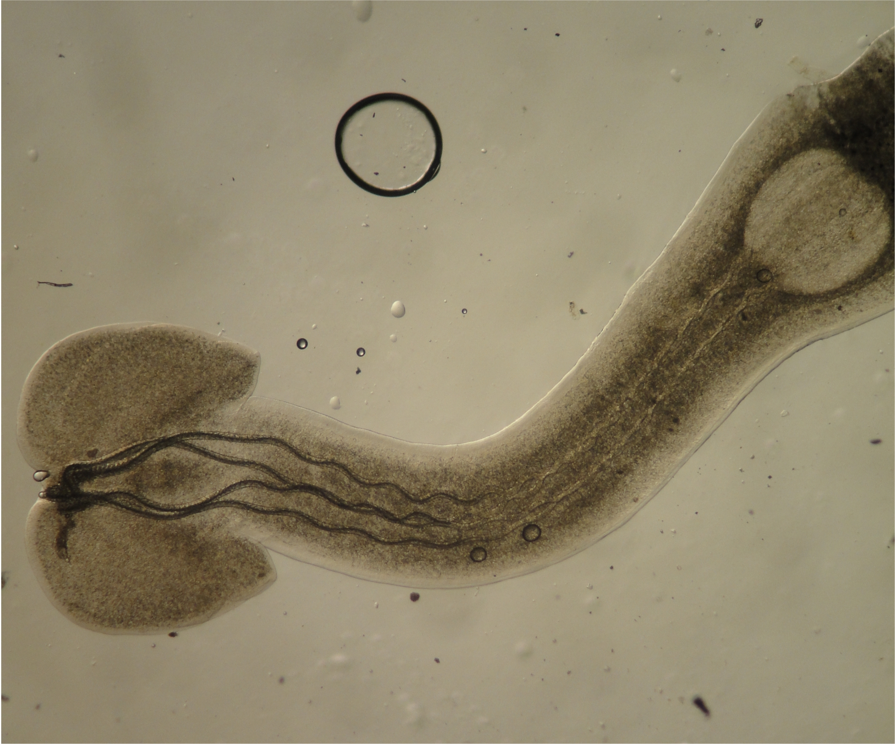

 

    
    <em>Trypanorhynch tapeworm from a coral reef fish of the Line Islands archipelago, courtesy of Chelsea Wood</em>

 

&copy; Chelsea Wood 2025

These materials are adapted from Armand Kuris' Parasitology course (EEMB 111) at UC Santa Barbara, with permission from Armand. Many labs are adapted from Kuris, Whitney, and McKenzie Parasitology Lab Exercises. If you would like to use these materials in your own teaching, please feel free, as they are licensed under [GPLv3](https://www.gnu.org/licenses/gpl-3.0.en.html). You can even reproduce and modify this entire website for your own use by [forking the code in GitHub](https://github.com/wood-lab/fish_406).

 

*This site was last updated at `r format(Sys.time(), "%H:%M")` on `r format(Sys.Date(), "%d %b %Y")`*

