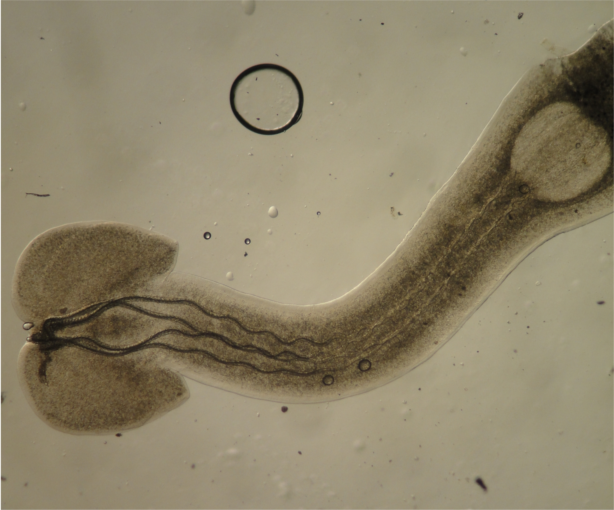

 

    
    <em>Trypanorhynch tapeworm from a coral reef fish of the Line Islands archipelago, courtesy of Chelsea Wood</em>

 

&copy; Chelsea Wood 2025

 

**This course is for everyone.** You might be taking this course as a student enrolled in FISH 406 at the University of Washington, but these materials aren't just for enrolled students. They're also for their friends and family who want to follow along, for folks who want to learn about parasites at their own pace, for home-school educators looking for  teaching materials, and for university-level instructors who want to teach their own Parasite Ecology course. Please feel free to use the materials on this site for any educational purpose, subject to [GPLv3](https://www.gnu.org/licenses/gpl-3.0.en.html) license. You can even reproduce and modify this entire website for your own use by [forking the code in GitHub](https://github.com/wood-lab/fish_406).

These materials are adapted from [Armand Kuris' Parasitology course (EEMB 111) at UC Santa Barbara](https://catalog.ucsb.edu/courses/EEMB%20111), with permission from Armand. Many labs are adapted from Kuris, Whitney, and McKenzie's *Parasitology Lab Exercises*. Many of the linked videos come from [Parasites Without Borders](https://parasiteswithoutborders.com), an educational resource for parasitic disease. Videos featuring me, Chelsea Wood, were designed, shot, and produced by Laura Swartley, Lissa Shaman, and Ian Lucero at the [University of Washington Continuum College](https://www.continuum.uw.edu). The template code used to produce this website was written by [Mark Scheuerell](https://github.com/mdscheuerell).

The production of these educational materials was made possible by a CAREER Award from the US National Science Foundation's Division of Environmental Biology ([NSF Grant Number 2141898](https://www.nsf.gov/awardsearch/showAward?AWD_ID=2141898&HistoricalAwards=false)).

 

*This site was last updated at `r format(Sys.time(), "%H:%M")` on `r format(Sys.Date(), "%d %b %Y")`*

